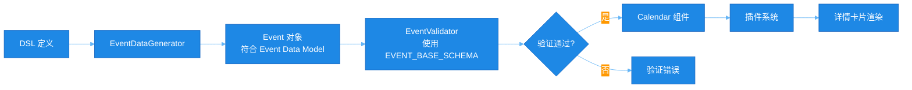
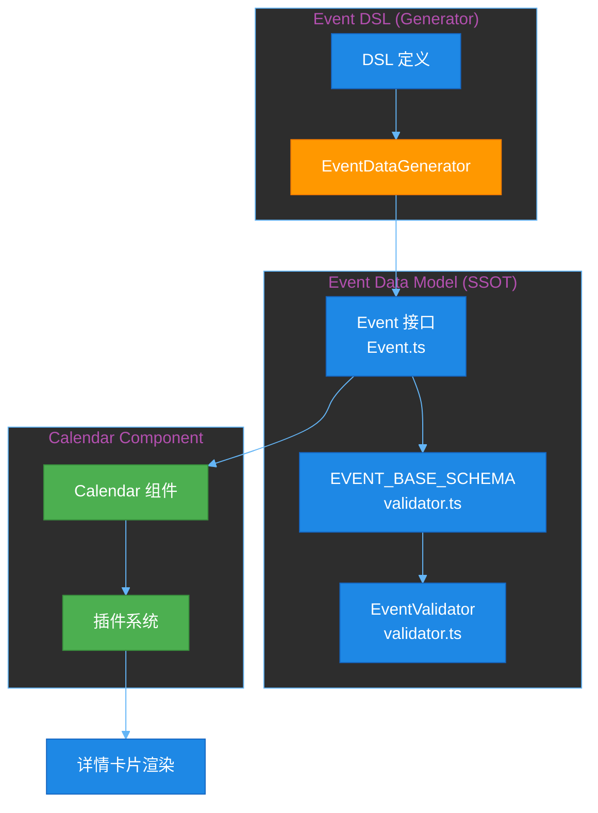
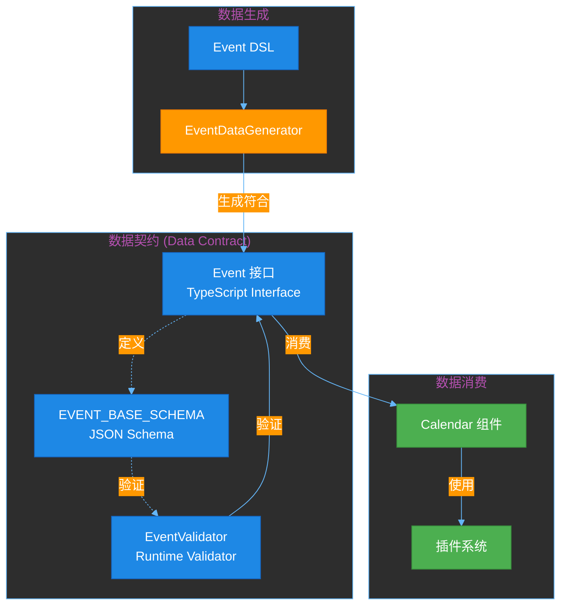
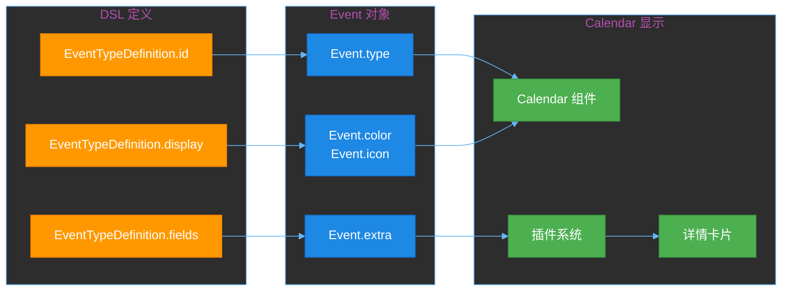

# RFC-0011: Event 数据模型与 Event DSL 集成

**状态**: Draft  
**创建日期**: 2026-01-01  
**最后更新**: 2026-01-01  
**作者**: CalenderJS Team  
**关联 RFC**: RFC-0001, RFC-0002, RFC-0009, RFC-0012

## 摘要

**本 RFC 的目的是澄清 Event Data Model 与 Event DSL 的架构关系，并设计插件/扩展机制。**

### 核心架构原则

1. **Event Data Model 是 SSOT（单一数据源）**
   - **定义位置**：`packages/event-model/src/Event.ts`
   - **接口结构**：`Event { id, type, title, startTime, endTime, color?, icon?, extra?, metadata? }`
   - **JSON Schema 位置**：`packages/event-model/src/validator.ts` 中的 `EVENT_BASE_SCHEMA`
   - **验证器位置**：`packages/event-model/src/validator.ts` 中的 `EventValidator`

2. **Event DSL 是生成工具（不是定义工具）**
   - **作用**：从 DSL 定义生成符合 Event Data Model 的 Event 数据
   - **不生成 JSON Schema**：Event Data Model 的 JSON Schema 已经在 `@calenderjs/event-model` 中定义
   - **生成 Event 对象**：使用 `EventDataGenerator` 从 DSL 生成 Event 数据
   - **DSL 类型**：`EventDSL`、`EventTypeDefinition`、`EventDSLCompiler`、`EventDSLRuntime`
   - **命名一致性**：所有 DSL 相关类型和类都使用 "Event" 前缀，而不是 "Appointment"

3. **Appointment 和 Holiday 都是 Event 的扩展**
   - 它们都是 Event，只是 `type` 不同
   - 区别在于详情卡片的数据不同（`extra` 字段内容不同）

4. **插件/扩展机制支持**
   - Event Data Model 应该支持插件/扩展机制（类似 Editor.js）
   - Calendar 组件应该允许注册自定义的详情卡片渲染器
   - 插件系统应该根据 `Event.type` 选择对应的渲染器

5. **数据流向**



本 RFC 确保架构关系清晰，DSL 能够正确生成符合 Event Data Model 的数据，并支持插件/扩展机制。

### 架构关系图



## 动机

当前状态：
- ✅ UI 组件（Calendar、WeekView、DayView、MonthView）已实现，可以显示日历网格
- ✅ Event 数据模型包已创建（`@calenderjs/event-model`）作为 SSOT
- ✅ Event 核心接口已定义（`packages/event-model/src/Event.ts`）
- ✅ Event DSL 编译器已实现（验证器、渲染器）
- ✅ Event 数据生成器已实现（`packages/event-dsl/src/generators/EventDataGenerator.ts`）
- ✅ 所有包已更新依赖 `@calenderjs/event-model`
- ✅ JSON Schema 验证功能已实现（`packages/event-model/src/validators/EventValidator.ts`，使用 ajv）
- ❌ Event 数据模型与 Event DSL 的集成尚未完成
- ❌ 日历组件中显示事件的功能尚未实现

需要解决的问题：
1. 如何从 Event DSL 定义生成符合 Event Data Model 的 Event 数据？
2. 如何确保生成的 Event 数据符合 Event Data Model 的结构？
3. 如何在日历组件中渲染事件？
4. 如何验证事件数据是否符合 Event Data Model？

## 目标

1. **明确架构关系**
   - Event Data Model 是 SSOT，定义了 Event 接口结构
   - DSL 是生成工具，用于生成符合 Event Data Model 的数据
   - DSL 生成 Event 数据，而不是定义数据模型

2. **实现 Event 数据生成工具**
   - 从 DSL 定义生成符合 Event Data Model 的 Event 对象
   - 提供 Event 数据生成器（`EventDataGenerator`）
   - 提供 Event 数据验证功能（基于 Event Data Model）

3. **实现日历组件事件显示**
   - 在 WeekView 中显示事件
   - 在 DayView 中显示事件
   - 在 MonthView 中显示事件
   - 支持事件样式和交互

## 范围

### In-Scope

- Event 数据模型与 Event DSL 的集成规范
- Event 数据生成工具（从 DSL 生成 Event 对象）
- 日历组件中事件渲染功能
- 事件数据验证功能（基于 Event Data Model）
- 事件样式和交互（基础功能）

### Out-of-Scope

- 事件编辑功能（后续 RFC）
- 事件拖拽功能（后续 RFC）
- 事件创建表单（后续 RFC）
- 事件详情弹窗（后续 RFC）
- **Calendar 插件机制实现**（见 RFC-0012）

### 数据契约（Data Contract）

**数据契约定义**：

数据契约是 Event Data Model 的正式规范，定义了 Calendar 组件与 Event 数据之间的接口约定。

**数据契约内容**：

```typescript
// 数据契约：Event 接口
interface Event {
  // Calendar 必需字段
  id: string;
  type: string;
  title: string;
  startTime: Date;
  endTime: Date;
  
  // Calendar 显示属性（可选）
  color?: string;
  icon?: string;
  
  // 扩展属性（可选，用于详情卡片）
  extra?: Record<string, any>;
  
  // 元数据（可选）
  metadata?: EventMetadata;
}
```

**数据契约的作用**：
- 定义 Calendar 组件消费 Event 数据的标准接口
- 确保所有 Event 数据都符合统一的结构
- 支持插件系统根据 `Event.type` 渲染不同的详情卡片
- 提供运行时验证（通过 JSON Schema）

**数据契约的位置**：
- Event 接口：`packages/event-model/src/Event.ts`
- JSON Schema：`packages/event-model/src/validator.ts` 中的 `EVENT_BASE_SCHEMA`
- 验证器：`packages/event-model/src/validator.ts` 中的 `EventValidator`

### 数据契约关系图



### Calendar 插件机制（设计说明）

**重要设计考虑**：

Calendar 组件将提供插件机制（见 RFC-0012），允许为不同类型的事件注册自定义的详情卡片渲染器。

**设计原则**（参考 Editor.js 插件架构）：

1. **Calendar 组件提供插件注册系统**
   - Calendar 组件负责插件注册和管理
   - 插件系统应该类似于 Editor.js 的插件架构

2. **插件接口设计**
   - 插件应该能够根据 `Event.type` 注册不同的渲染器
   - 插件应该能够访问 `Event.extra` 字段来渲染详情卡片
   - 插件应该能够访问数据契约（Event 接口）

3. **扩展性**
   - 插件应该能够扩展 Calendar 功能，而不修改核心代码
   - 插件系统应该易于使用和扩展

**详细设计**：见 RFC-0012

## 核心交付物

1. **Event 数据模型规范文档**
   - Event 接口与 DSL 映射关系
   - Event.data 字段规范
   - JSON Schema 生成规则

2. **Event 数据生成工具**
   - `packages/event-dsl/src/generators/event-data-generator.ts`
   - 从 DSL 生成 Event JSON 示例
   - 从 DSL 生成 Event TypeScript 类型

3. **日历组件事件渲染**
   - WeekView 事件渲染
   - DayView 事件渲染
   - MonthView 事件渲染
   - 事件样式支持

4. **事件数据验证**
   - Event 数据验证工具
   - 与 DSL 验证器集成

## 成功标准

1. ✅ 可以从 Event DSL 定义生成符合 Event 接口的 JSON 数据模型
2. ✅ Event.data 字段符合 DSL 定义的字段结构
3. ✅ 日历组件可以正确显示事件（WeekView、DayView、MonthView）
4. ✅ 事件数据可以通过 DSL 验证器验证
5. ✅ 所有代码达到 100% 测试覆盖率
6. ✅ 所有测试通过

## 详细设计

### 0. Event Data Model 定义位置（SSOT）

**`@calenderjs/event-model` 包的两个核心职责：**

#### 职责 1: 定义数据模型和 JSON Schema（数据契约）

**数据契约（Data Contract）定义**：

数据契约是 Event Data Model 的正式规范，定义了 Calendar 组件与 Event 数据之间的接口约定。

1. **Event 接口定义（数据契约的核心）**
   - **文件**：`packages/event-model/src/Event.ts`
   - **内容**：`Event` 和 `EventMetadata` 接口定义
   - **导出**：`export * from "./Event"`
   - **作用**：定义 Calendar 组件消费 Event 数据的接口契约

2. **Event JSON Schema（数据契约的验证规范）**
   - **文件**：`packages/event-model/src/validator.ts`
   - **内容**：`EVENT_BASE_SCHEMA` 常量，定义 Event 接口的 JSON Schema
   - **导出**：`export * from "./validator"`（包含 `EVENT_BASE_SCHEMA`）
   - **作用**：提供运行时验证，确保数据符合数据契约

3. **JSON Schema 类型定义**
   - **文件**：`packages/event-model/src/types.ts`
   - **内容**：`JSONSchema` 接口定义
   - **导出**：`export * from "./types"`

**数据契约内容**：

```typescript
// 数据契约：Event 接口
interface Event {
  // Calendar 必需字段
  id: string;
  type: string;
  title: string;
  startTime: Date;
  endTime: Date;
  
  // Calendar 显示属性（可选）
  color?: string;
  icon?: string;
  
  // 扩展属性（可选，用于详情卡片）
  extra?: Record<string, any>;
  
  // 元数据（可选）
  metadata?: EventMetadata;
}
```

**数据契约的作用**：
- 定义 Calendar 组件消费 Event 数据的标准接口
- 确保所有 Event 数据都符合统一的结构
- 支持插件系统根据 `Event.type` 渲染不同的详情卡片

#### 职责 2: 使用 JSON Schema 验证数据

1. **Event 验证器**
   - **文件**：`packages/event-model/src/validator.ts`
   - **内容**：`EventValidator` 类，使用 `EVENT_BASE_SCHEMA` 验证 Event 数据
   - **方法**：
     - `validateBase(event)` - 验证 Event 对象是否符合基础 Event Schema
     - `validateData(event, dataSchema)` - 验证 Event.data 是否符合指定的 JSON Schema
     - `validate(event, dataSchema?)` - 验证完整的 Event 对象
     - `validateTimeLogic(event)` - 验证时间逻辑（startTime < endTime）
   - **导出**：`export * from "./validator"`

**重要架构原则**：
- Event Data Model 的 JSON Schema（`EVENT_BASE_SCHEMA`）在 `@calenderjs/event-model` 中定义
- DSL **不生成** JSON Schema，只生成符合 Event Data Model 的 Event 数据
- DSL 使用 Event Data Model 的 JSON Schema（`EVENT_BASE_SCHEMA`）进行验证

### 1. Event 数据模型规范

#### 1.1 Event 接口结构

```typescript
// packages/event-model/src/Event.ts
export interface Event {
  /** 唯一标识符 */
  id: string;
  /** 事件类型 (如 meeting, task, reminder) */
  type: string;
  /** 事件标题（Calendar 显示用） */
  title: string;
  /** 开始时间（必需 - Event 必须有时间） */
  startTime: Date;
  /** 结束时间（必需 - Event 必须有时间） */
  endTime: Date;
  /** Calendar 显示颜色（可选） */
  color?: string;
  /** Calendar 显示图标（可选） */
  icon?: string;
  /** 扩展属性（可选，用于详情卡片显示） */
  extra?: Record<string, any>;
  /** 事件元数据（可选） */
  metadata?: EventMetadata;
}
```

#### 1.2 Event 数据模型设计原则

**核心设计理念**：

1. **Calendar 只关心 Event**
   - Calendar 组件处理的是 Event（时间敏感的活动）
   - Event 必须有 `startTime` 和 `endTime`

2. **Appointment 和 Holiday 都是 Event 的扩展**
   - Appointment 和 Holiday 都是 Event，只是 `type` 不同
   - 它们都有 `startTime` 和 `endTime`，所以是 Event
   - 区别在于：在 Calendar 中显示时，它们有不同的详情卡片

3. **Event 包含 Calendar 需要的数据**
   - Event 数据模型包含 Calendar 显示所需的核心字段
   - `id`, `type`, `title`, `startTime`, `endTime` - Calendar 必需
   - `color`, `icon` - Calendar 显示属性（可选）

4. **扩展属性用于详情卡片**
   - Event 的 `extra` 字段存储详情卡片数据
   - 不同类型的事件（meeting, appointment, holiday）有不同的 `extra` 内容
   - 在 Calendar 中显示时，根据 `type` 显示不同的详情卡片
   - 由 Event DSL 定义，用于不同类型的事件

5. **插件/扩展机制支持**
   - Event Data Model 应该支持插件/扩展机制（类似 Editor.js）
   - Calendar 组件应该允许注册自定义的详情卡片渲染器
   - 插件系统应该根据 `Event.type` 选择对应的渲染器
   - 插件应该能够访问 `Event.extra` 字段来渲染详情卡片

**Event 接口结构**：

```typescript
interface Event {
  // Calendar 必需字段
  id: string;
  type: string;
  title: string;
  startTime: Date;  // 必需 - Event 必须有时间
  endTime: Date;    // 必需 - Event 必须有时间
  
  // Calendar 显示属性（可选）
  color?: string;
  icon?: string;
  
  // 扩展属性（可选，用于详情卡片）
  extra?: Record<string, any>;
  
  // 元数据（可选）
  metadata?: EventMetadata;
}
```

**`Event.extra` 字段示例**：

```typescript
// meeting 类型的 Event
const meetingEvent: Event = {
  id: "event-1",
  type: "meeting",
  title: "团队会议",
  startTime: new Date("2025-01-15T10:00:00"),
  endTime: new Date("2025-01-15T11:00:00"),
  color: "#4285f4",
  extra: {
    attendees: ["user1@example.com", "user2@example.com"],
    location: "会议室 A",
    agenda: "讨论项目进度"
  }
};

// appointment 类型的 Event（扩展的 Event）
const appointmentEvent: Event = {
  id: "event-2",
  type: "appointment",
  title: "医生预约",
  startTime: new Date("2025-01-15T14:00:00"),
  endTime: new Date("2025-01-15T15:00:00"),
  color: "#fbbc04",
  extra: {
    doctor: "Dr. Smith",
    department: "内科",
    notes: "带病历"
  }
};

// holiday 类型的 Event（扩展的 Event）
const holidayEvent: Event = {
  id: "event-3",
  type: "holiday",
  title: "春节",
  startTime: new Date("2025-01-29T00:00:00"),
  endTime: new Date("2025-02-04T23:59:59"),
  color: "#ea4335",
  extra: {
    country: "CN",
    isOfficial: true,
    description: "法定节假日"
  }
};

// task 类型的 Event
const taskEvent: Event = {
  id: "event-4",
  type: "task",
  title: "完成报告",
  startTime: new Date("2025-01-15T14:00:00"),
  endTime: new Date("2025-01-15T16:00:00"),
  color: "#34a853",
  extra: {
    assignee: "user1@example.com",
    status: "in-progress",
    priority: "high"
  }
};
```

**重要**：
- Appointment 和 Holiday 都是 Event 的扩展类型
- 它们都是 Event，只是 `type` 不同，`extra` 的内容不同
- 在 Calendar 中显示时，根据 `type` 显示不同的详情卡片
- Event 的 `extra` 字段由 Event DSL 定义，用于详情卡片显示
- Calendar 只使用 Event 的核心字段（id, type, title, startTime, endTime, color, icon）进行显示

#### 1.3 Event 类型与 DSL 类型关联

- `Event.type` 字段对应 DSL 的 `EventTypeDefinition.id`
- `Event.extra` 字段的值由 DSL 的 `EventTypeDefinition.fields` 生成
- `Event.color` 和 `Event.icon` 由 DSL 的 `EventTypeDefinition.display` 生成
- **重要**：
  - Event Data Model 定义了结构（在 `@calenderjs/event-model` 中）
  - Event Data Model 的 JSON Schema 在 `packages/event-model/src/validator.ts` 中定义（`EVENT_BASE_SCHEMA`）
  - DSL 生成符合 Event Data Model 的数据，不生成 JSON Schema
  - Event 数据验证使用 Event Data Model 的 JSON Schema（`EVENT_BASE_SCHEMA`）
  - Calendar 组件通过插件系统根据 `Event.type` 渲染不同的详情卡片

**Event 类型映射关系图**：



### 2. Event 数据生成工具

**架构说明**：
- Event Data Model 是 SSOT，定义了 Event 接口结构
- DSL 是生成工具，用于生成符合 Event Data Model 的数据
- `EventDataGenerator` 从 DSL 定义生成 Event 对象

**命名规范（已统一）**

Event DSL 中的所有类型和类已统一使用 "Event" 前缀，与架构设计一致：

- ✅ `EventDSL` - Event DSL 根类型
- ✅ `EventTypeDefinition` - 事件类型定义
- ✅ `EventDSLCompiler` - Event DSL 编译器
- ✅ `EventDSLRuntime` - Event DSL 运行时
- ✅ `RenderedEvent` - 渲染后的事件信息
- ✅ `EventValidator` - 全局验证器（注意：与 event-model 中的 EventValidator 不同）
- ✅ `EventRule` - 全局规则
- ✅ `Event` 接口 - 在 @calenderjs/event-model 中定义（SSOT）

**架构原则**：
- DSL 生成 Event 对象，而不是 Appointment 对象
- Appointment 只是 Event 的一个扩展类型（`type: "appointment"`）
- 所有 DSL 相关类型和类都使用 "Event" 前缀，保持命名一致性

#### 2.1 Event 数据生成

```typescript
// packages/event-dsl/src/generators/EventDataGenerator.ts
export class EventDataGenerator {
  /**
   * 从 DSL 定义生成符合 Event Data Model 的 Event 对象
   */
  generateEvent(
    dslType: EventTypeDefinition,
    overrides?: Partial<Event>
  ): Event {
    // 根据字段定义生成 data 字段的默认值
    const data: Record<string, any> = {};
    dslType.fields.forEach(field => {
      data[field.name] = this.generateFieldValue(field);
    });
    
    // 生成默认时间（当前时间 + 1小时）
    const now = new Date();
    const defaultStartTime = overrides?.startTime || now;
    const defaultEndTime = overrides?.endTime || new Date(now.getTime() + 60 * 60 * 1000);
    
    // 生成标题（使用模板或默认值）
    const title = this.generateTitle(dslType, data, overrides?.title);
    
    return {
      id: overrides?.id || this.generateId(),
      type: dslType.id,
      title: title,
      startTime: defaultStartTime,
      endTime: defaultEndTime,
      data: { ...data, ...(overrides?.data || {}) },
      metadata: overrides?.metadata || this.generateMetadata(),
    };
  }
  
  /**
   * 生成字段默认值
   */
  private generateFieldValue(field: FieldDefinition): any {
    if (field.default !== undefined) {
      return field.default;
    }
    
    switch (field.type) {
      case 'string':
        return '';
      case 'number':
        return 0;
      case 'boolean':
        return false;
      case 'date':
        return new Date().toISOString();
      case 'time':
        return '00:00';
      case 'enum':
        return field.enum?.[0] || '';
      case 'array':
        return [];
      case 'object':
        return {};
      default:
        return null;
    }
  }
}
```

#### 2.2 使用示例

```typescript
import { EventDataGenerator } from '@calenderjs/event-dsl';
import type { EventTypeDefinition } from '@calenderjs/event-dsl';

const meetingType: EventTypeDefinition = {
  id: 'meeting',
  name: '会议',
  fields: [
    { name: 'attendees', type: 'array', items: { type: 'string' }, required: true },
    { name: 'location', type: 'string' },
    { name: 'priority', type: 'enum', enum: ['low', 'normal', 'high'], default: 'normal' }
  ],
  display: {
    color: '#4285f4',
    titleTemplate: '${title}'
  },
  behavior: {
    defaultDuration: 60
  }
};

const generator = new EventDataGenerator();
const event = generator.generateEvent(meetingType, {
  title: '团队会议',
  startTime: new Date('2026-01-15T10:00:00'),
  endTime: new Date('2026-01-15T11:00:00')
});

// 生成的 Event 对象符合 Event Data Model
console.log(event);
// {
//   id: "event-...",
//   type: "meeting",
//   title: "团队会议",
//   startTime: Date,
//   endTime: Date,
//   color: "#4285f4",
//   extra: {
//     attendees: [],
//     location: "",
//     priority: "normal"
//   },
//   metadata: { createdAt: Date, updatedAt: Date }
// }
```

### 3. 日历组件事件渲染

**数据契约消费**：

Calendar 组件消费 Event Data Model 时，必须遵循数据契约：

- Calendar 组件只能访问 Event 接口定义的字段
- Calendar 组件应该使用 `Event.extra` 字段来获取详情卡片数据
- Calendar 组件应该根据 `Event.type` 选择不同的渲染方式

**插件机制**：

Calendar 组件将提供插件机制（见 RFC-0012），允许为不同类型的事件注册自定义的详情卡片渲染器。

**设计原则**（参考 Editor.js 插件架构）：

1. **Calendar 组件提供插件注册系统**
   - Calendar 组件负责插件注册和管理
   - 插件系统应该类似于 Editor.js 的插件架构

2. **插件接口设计**
   - 插件应该能够根据 `Event.type` 注册不同的渲染器
   - 插件应该能够访问 `Event.extra` 字段来渲染详情卡片
   - 插件应该能够访问数据契约（Event 接口）

3. **扩展性**
   - 插件应该能够扩展 Calendar 功能，而不修改核心代码
   - 插件系统应该易于使用和扩展

**详细设计**：见 RFC-0012

#### 3.1 WeekView 事件渲染

```typescript
// packages/calendar/src/views/WeekView.wsx
// 在现有的 WeekView 中添加事件渲染

// 计算事件位置和大小
private calculateEventPosition(event: Event): {
  top: number;
  height: number;
  left: number;
  width: number;
} {
  const startHour = event.startTime.getHours();
  const startMinute = event.startTime.getMinutes();
  const endHour = event.endTime.getHours();
  const endMinute = event.endTime.getMinutes();
  
  const slotHeight = 48; // 每个小时的高度（像素）
  const slotDuration = 60; // 每个时段的时长（分钟）
  
  const top = calculateAppointmentTop(event, slotHeight, slotDuration);
  const height = calculateAppointmentHeight(event, slotHeight, slotDuration);
  
  // 计算事件在星期几（0=周日，1=周一...）
  const dayOfWeek = event.startTime.getDay();
  const dayIndex = (dayOfWeek === 0 ? 7 : dayOfWeek) - 1; // 转换为周一=0
  
  const left = (dayIndex * 100) / 7; // 百分比
  const width = 100 / 7; // 百分比
  
  return { top, height, left, width };
}

// 渲染事件
private renderEvent(event: Event) {
  const position = this.calculateEventPosition(event);
  const dslType = this.getDSLType(event.type);
  const rendered = dslType 
    ? this.dslRuntime.render(event, event.type)
    : { title: event.title, color: '#4285f4' };
  
  return (
    <div
      class="week-view-event"
      style={{
        top: `${position.top}px`,
        height: `${position.height}px`,
        left: `${position.left}%`,
        width: `${position.width}%`,
        backgroundColor: rendered.color,
      }}
      onClick={() => this.handleEventClick(event)}
    >
      {rendered.title}
    </div>
  );
}
```

#### 3.2 DayView 事件渲染

类似 WeekView，但只显示单天的事件。

#### 3.3 MonthView 事件渲染

在月份视图中，事件显示为日期上的小点或标签。

### 4. 事件数据验证

**验证架构**：
- Event Data Model 定义了 Event 接口结构
- `@calenderjs/event-model` 提供 `EventValidator` 用于验证 Event 数据是否符合 Event Data Model
- DSL 验证器用于验证业务规则（如字段值、跨字段验证等）

```typescript
// 使用 Event Data Model 的验证器
import { EventValidator } from '@calenderjs/event-model';
import { EventDSLRuntime } from '@calenderjs/event-dsl';

const eventValidator = new EventValidator();
const dslRuntime = new EventDSLRuntime(ast);

// 1. 验证 Event 数据是否符合 Event Data Model
const baseResult = eventValidator.validateBase(event);
if (!baseResult.valid) {
  return baseResult;
}

// 2. 使用 DSL 验证器验证业务规则
const dslResult = dslRuntime.validate(event, context);
if (!dslResult.valid) {
  return dslResult;
}

// 3. 验证时间逻辑
const timeResult = eventValidator.validateTimeLogic(event);
if (!timeResult.valid) {
  return timeResult;
}

return { valid: true, errors: [] };
```

## 实施计划

### 阶段一：Event 数据模型规范定义

**步骤 1.1**: 更新 Event 接口文档
- 文件：`packages/event-model/src/Event.ts`
- 添加详细的注释说明 Event.data 字段与 DSL 的关系
- ✅ 完成标准：注释完整，类型定义清晰
- ✅ 测试要求：100% 覆盖率，所有测试通过
- ✅ 状态：已完成

**步骤 1.2**: 创建 Event 数据模型规范文档
- 文件：`docs/event-data-model.md`
- 详细说明 Event 接口与 DSL 的映射关系
- ✅ 完成标准：文档完整，示例清晰

**步骤 1.3**: 实现 JSON Schema 验证功能
- 文件：`packages/event-model/src/validators/EventValidator.ts`
- 使用 ajv 实现 Event 数据验证
- 实现 EventValidator 类，支持基本结构验证和 JSON Schema 验证
- ✅ 完成标准：可以验证 Event 基本结构和 Event.data 字段
- ✅ 测试要求：100% 覆盖率，所有测试通过
- ✅ 状态：已完成

### 阶段二：Event 数据生成工具

**步骤 2.1**: 创建 EventDataGenerator 类
- 文件：`packages/event-dsl/src/generators/EventDataGenerator.ts`
- 实现从 DSL 生成符合 Event Data Model 的 Event 对象
- ✅ 完成标准：可以生成符合 Event 接口的 Event 对象
- ✅ 测试要求：100% 覆盖率，所有测试通过
- ✅ 状态：已完成

**步骤 2.2**: 移除 JSON Schema 生成逻辑
- 文件：`packages/event-dsl/src/compiler.ts`
- 移除 `generateJSONSchema` 和 `fieldToJSONSchema` 方法
- 更新 `CompiledType` 接口，移除 `schema` 字段
- ✅ 完成标准：DSL 编译器不再生成 JSON Schema
- ✅ 测试要求：所有测试通过
- ✅ 状态：已完成

**步骤 2.3**: 导出生成器
- 文件：`packages/event-dsl/src/index.ts`
- 导出 EventDataGenerator
- ✅ 完成标准：导出正确，类型定义完整
- ✅ 测试要求：100% 覆盖率，所有测试通过
- ✅ 状态：已完成

### 阶段三：日历组件事件渲染

**步骤 3.1**: 在 WeekView 中添加事件渲染
- 文件：`packages/calendar/src/views/WeekView.wsx`
- 实现事件位置计算和渲染
- ✅ 完成标准：事件可以正确显示在周视图中
- ✅ 测试要求：100% 覆盖率，所有测试通过

**步骤 3.2**: 在 DayView 中添加事件渲染
- 文件：`packages/calendar/src/views/DayView.wsx`
- 实现事件位置计算和渲染
- ✅ 完成标准：事件可以正确显示在日视图中
- ✅ 测试要求：100% 覆盖率，所有测试通过

**步骤 3.3**: 在 MonthView 中添加事件渲染
- 文件：`packages/calendar/src/views/MonthView.wsx`
- 实现事件显示（小点或标签）
- ✅ 完成标准：事件可以正确显示在月视图中
- ✅ 测试要求：100% 覆盖率，所有测试通过

### 阶段四：事件数据验证

**步骤 4.1**: 创建 EventValidator 类
- 文件：`packages/event-dsl/src/validators/event-validator.ts`
- 实现 Event 数据验证功能
- ✅ 完成标准：可以验证 Event 数据是否符合 DSL 定义
- ✅ 测试要求：100% 覆盖率，所有测试通过

**步骤 4.2**: 集成到日历组件
- 文件：`packages/calendar/src/Calendar.wsx`
- 在事件数据传入时进行验证
- ✅ 完成标准：事件数据验证功能正常工作
- ✅ 测试要求：100% 覆盖率，所有测试通过

## 变更历史

- 2026-01-01: 初始创建
- 2026-01-01: 创建 `@calenderjs/event-model` 包作为 SSOT，更新所有依赖关系
- 2026-01-01: 为 `@calenderjs/event-model` 添加 JSON Schema 验证功能（使用 ajv），实现 EventValidator 类
- 2026-01-01: **架构调整**：明确 DSL 是生成工具而非定义工具
  - 移除 DSL 编译器中的 JSON Schema 生成逻辑
  - 创建 EventDataGenerator 用于从 DSL 生成 Event 数据
  - 更新 CompiledType 接口，移除 schema 字段
  - Event Data Model 是 SSOT，定义了 Event 接口结构
  - DSL 用于生成符合 Event Data Model 的数据
- 2026-01-01: **Event 数据模型重新设计**
  - 将 `data` 字段改为 `extra`（扩展属性，用于详情卡片）
  - 添加 `color` 和 `icon` 字段（Calendar 显示属性）
  - 明确 Appointment 和 Holiday 都是 Event 的扩展类型
  - 区别在于详情卡片的数据不同（`extra` 字段内容不同）
- 2026-01-01: **插件/扩展机制设计**
  - 添加插件/扩展机制设计说明（参考 Editor.js 插件架构）
  - Event Data Model 应该支持插件注册系统
  - Calendar 组件应该允许注册自定义的详情卡片渲染器
  - 插件系统应该根据 `Event.type` 选择对应的渲染器
- 2026-01-01: **命名规范统一**
  - 完成 Event DSL 中所有 "Appointment" 术语的重命名
  - **重命名完成**：
    - ✅ `AppointmentDSL` → `EventDSL`
    - ✅ `AppointmentType` → `EventTypeDefinition`
    - ✅ `AppointmentDSLCompiler` → `EventDSLCompiler`
    - ✅ `RenderedAppointment` → `RenderedEvent`
    - ✅ `AppointmentValidator` → `EventValidator`
    - ✅ `AppointmentRule` → `EventRule`
    - ✅ `Appointment` 接口 → 移除，改用 `Event`（已在 event-model 中定义）
  - **架构一致性**：所有 DSL 相关类型和类都使用 "Event" 前缀，与 Event Data Model 保持一致