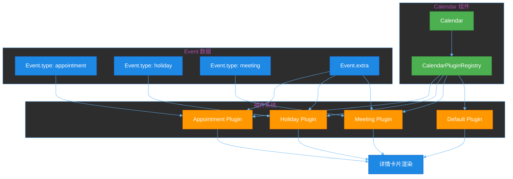
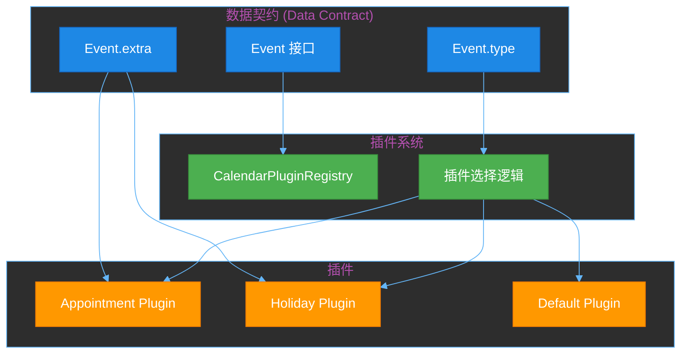
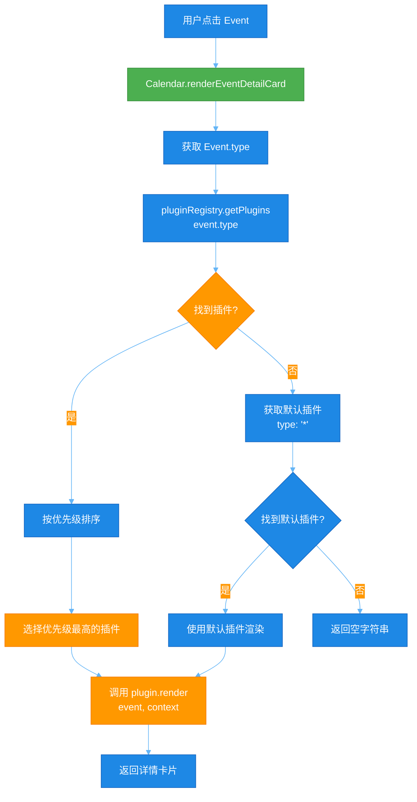
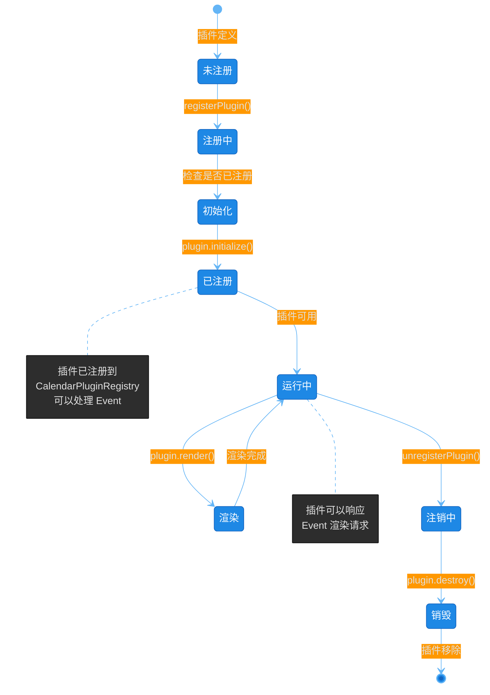

# RFC-0012: Calendar 插件机制

**状态**: Draft  
**创建日期**: 2026-01-01  
**最后更新**: 2026-01-01  
**作者**: CalenderJS Team  
**关联 RFC**: RFC-0009, RFC-0011

## 摘要

设计并实现 Calendar 组件的插件机制，允许为不同类型的事件（Event）注册自定义的详情卡片渲染器。

**核心设计理念**（参考 Editor.js 插件架构）：
- Calendar 组件提供插件注册系统
- 插件根据 `Event.type` 注册不同的详情卡片渲染器
- 插件可以访问 `Event.extra` 字段来渲染详情卡片
- 插件系统应该易于扩展，不修改核心代码

### 插件系统架构图



## 动机

当前状态：
- ✅ Calendar 组件已实现（WeekView、DayView、MonthView）
- ✅ Event Data Model 已定义（`@calenderjs/event-model`）
- ✅ Event 接口包含 `extra` 字段（用于详情卡片数据）
- ❌ Calendar 组件缺少插件机制
- ❌ 无法为不同类型的事件渲染不同的详情卡片

需要解决的问题：
1. 如何为不同类型的事件（appointment, holiday, meeting）渲染不同的详情卡片？
2. 如何设计插件系统，使其易于扩展？
3. 如何确保插件系统不影响 Calendar 核心功能？

## 目标

1. **设计插件接口**
   - 定义插件接口规范
   - 支持根据 `Event.type` 注册不同的渲染器
   - 支持插件访问 `Event.extra` 字段

2. **实现插件注册系统**
   - Calendar 组件提供插件注册 API
   - 支持注册、注销、查询插件
   - 支持插件优先级和冲突处理

3. **实现详情卡片渲染**
   - 根据 `Event.type` 选择对应的插件
   - 使用插件渲染详情卡片
   - 支持默认插件（当没有注册插件时）

## 范围

### In-Scope

- 插件接口定义
- 插件注册系统
- 详情卡片渲染机制
- 插件生命周期管理
- 插件与 Calendar 组件的集成

### Out-of-Scope

- 插件市场或插件分发机制
- 插件权限系统
- 插件热加载
- 插件配置管理

## 核心交付物

1. **插件接口定义**
   - `EventDetailCardPlugin` 接口
   - 插件注册 API
   - 插件渲染方法

2. **插件注册系统**
   - `CalendarPluginRegistry` 类
   - 插件注册、注销、查询方法
   - 插件优先级处理

3. **详情卡片渲染**
   - 根据 `Event.type` 选择插件
   - 渲染详情卡片
   - 默认插件支持

## 成功标准

1. ✅ 可以为不同类型的事件注册自定义详情卡片渲染器
2. ✅ 插件系统支持注册、注销、查询插件
3. ✅ Calendar 组件可以根据 `Event.type` 渲染不同的详情卡片
4. ✅ 插件系统不影响 Calendar 核心功能
5. ✅ 所有代码达到 100% 测试覆盖率
6. ✅ 所有测试通过

## 详细设计

### 1. 数据契约

**数据契约定义**（来自 RFC-0011）：

Event Data Model 定义了 Calendar 组件消费 Event 数据的标准接口：

```typescript
interface Event {
  id: string;
  type: string;
  title: string;
  startTime: Date;
  endTime: Date;
  color?: string;
  icon?: string;
  extra?: Record<string, any>; // 详情卡片数据
  metadata?: EventMetadata;
}
```

**数据契约的作用**：
- 定义 Calendar 组件消费 Event 数据的标准接口
- 确保所有 Event 数据都符合统一的结构
- 支持插件系统根据 `Event.type` 渲染不同的详情卡片

**数据契约与插件系统关系图**：



### 2. 插件接口设计

#### 2.1 EventDetailCardPlugin 接口

```typescript
/**
 * 事件详情卡片插件接口
 * 
 * 参考 Editor.js 插件架构设计
 */
interface EventDetailCardPlugin {
  /** 插件名称 */
  name: string;
  
  /** 支持的事件类型（对应 Event.type） */
  type: string | string[];
  
  /** 插件版本 */
  version?: string;
  
  /** 插件优先级（数字越大优先级越高，默认 0） */
  priority?: number;
  
  /**
   * 渲染详情卡片
   * 
   * @param event - Event 对象
   * @param context - 渲染上下文（可选）
   * @returns 详情卡片的 HTML 字符串或 HTMLElement
   */
  render(event: Event, context?: RenderContext): string | HTMLElement;
  
  /**
   * 检查是否支持该事件类型
   * 
   * @param eventType - 事件类型（Event.type）
   * @returns 是否支持
   */
  supports(eventType: string): boolean;
  
  /**
   * 插件初始化（可选）
   * 
   * @param calendar - Calendar 组件实例
   */
  initialize?(calendar: Calendar): void;
  
  /**
   * 插件销毁（可选）
   */
  destroy?(): void;
}
```

#### 2.2 RenderContext 接口

```typescript
/**
 * 渲染上下文
 */
interface RenderContext {
  /** 用户上下文 */
  user?: User;
  
  /** Calendar 组件实例 */
  calendar?: Calendar;
  
  /** 其他上下文数据 */
  [key: string]: any;
}
```

### 3. 插件注册系统

#### 3.1 CalendarPluginRegistry 类

```typescript
/**
 * Calendar 插件注册表
 * 
 * 管理所有注册的插件，提供注册、注销、查询功能
 */
class CalendarPluginRegistry {
  private plugins: Map<string, EventDetailCardPlugin[]> = new Map();
  
  /**
   * 注册插件
   * 
   * @param plugin - 插件实例
   */
  register(plugin: EventDetailCardPlugin): void;
  
  /**
   * 注销插件
   * 
   * @param pluginName - 插件名称
   */
  unregister(pluginName: string): void;
  
  /**
   * 获取支持指定事件类型的插件
   * 
   * @param eventType - 事件类型
   * @returns 插件列表（按优先级排序）
   */
  getPlugins(eventType: string): EventDetailCardPlugin[];
  
  /**
   * 获取所有注册的插件
   * 
   * @returns 插件列表
   */
  getAllPlugins(): EventDetailCardPlugin[];
}
```

#### 3.2 Calendar 组件集成

```typescript
/**
 * Calendar 组件应该提供插件注册 API
 */
class Calendar {
  private pluginRegistry: CalendarPluginRegistry;
  
  /**
   * 注册插件
   * 
   * @param plugin - 插件实例
   */
  registerPlugin(plugin: EventDetailCardPlugin): void;
  
  /**
   * 注销插件
   * 
   * @param pluginName - 插件名称
   */
  unregisterPlugin(pluginName: string): void;
  
  /**
   * 渲染事件详情卡片
   * 
   * @param event - Event 对象
   * @returns 详情卡片的 HTML 字符串或 HTMLElement
   */
  renderEventDetailCard(event: Event): string | HTMLElement;
}
```

### 4. 插件使用示例

#### 4.1 注册 Appointment 插件

```typescript
import { Calendar } from '@calenderjs/calendar';
import type { Event } from '@calenderjs/event-model';

const appointmentPlugin: EventDetailCardPlugin = {
  name: 'appointment-detail-card',
  type: 'appointment',
  priority: 10,
  
  supports(eventType: string): boolean {
    return eventType === 'appointment';
  },
  
  render(event: Event, context?: RenderContext): string {
    const { doctor, department, notes } = event.extra || {};
    
    return `
      <div class="appointment-detail-card">
        <h3>${event.title}</h3>
        <p>医生: ${doctor}</p>
        <p>科室: ${department}</p>
        ${notes ? `<p>备注: ${notes}</p>` : ''}
      </div>
    `;
  }
};

// 注册插件
calendar.registerPlugin(appointmentPlugin);
```

#### 4.2 注册 Holiday 插件

```typescript
const holidayPlugin: EventDetailCardPlugin = {
  name: 'holiday-detail-card',
  type: 'holiday',
  priority: 10,
  
  supports(eventType: string): boolean {
    return eventType === 'holiday';
  },
  
  render(event: Event, context?: RenderContext): string {
    const { country, isOfficial, description } = event.extra || {};
    
    return `
      <div class="holiday-detail-card">
        <h3>${event.title}</h3>
        <p>国家: ${country}</p>
        <p>类型: ${isOfficial ? '法定节假日' : '假期'}</p>
        ${description ? `<p>${description}</p>` : ''}
      </div>
    `;
  }
};

// 注册插件
calendar.registerPlugin(holidayPlugin);
```

#### 4.3 默认插件

```typescript
const defaultPlugin: EventDetailCardPlugin = {
  name: 'default-detail-card',
  type: '*', // 支持所有类型
  priority: 0, // 最低优先级
  
  supports(eventType: string): boolean {
    return true; // 支持所有类型
  },
  
  render(event: Event, context?: RenderContext): string {
    return `
      <div class="default-detail-card">
        <h3>${event.title}</h3>
        <p>时间: ${event.startTime.toLocaleString()} - ${event.endTime.toLocaleString()}</p>
        ${event.extra ? `<pre>${JSON.stringify(event.extra, null, 2)}</pre>` : ''}
      </div>
    `;
  }
};

// 注册默认插件（当没有其他插件时使用）
calendar.registerPlugin(defaultPlugin);
```

### 5. 插件选择逻辑

```typescript
/**
 * Calendar 组件渲染详情卡片时的插件选择逻辑
 */
class Calendar {
  renderEventDetailCard(event: Event): string | HTMLElement {
    // 1. 获取支持该事件类型的插件（按优先级排序）
    const plugins = this.pluginRegistry.getPlugins(event.type);
    
    // 2. 选择优先级最高的插件
    const plugin = plugins[0];
    
    if (!plugin) {
      // 3. 如果没有找到插件，使用默认插件
      const defaultPlugin = this.pluginRegistry.getPlugins('*')[0];
      if (defaultPlugin) {
        return defaultPlugin.render(event, this.getRenderContext());
      }
      
      // 4. 如果连默认插件都没有，返回空字符串
      return '';
    }
    
    // 5. 使用选中的插件渲染详情卡片
    return plugin.render(event, this.getRenderContext());
  }
}
```

**插件选择流程图**：



### 6. 插件生命周期

```typescript
/**
 * 插件生命周期管理
 */
class Calendar {
  private plugins: EventDetailCardPlugin[] = [];
  
  registerPlugin(plugin: EventDetailCardPlugin): void {
    // 1. 检查插件是否已注册
    if (this.plugins.find(p => p.name === plugin.name)) {
      throw new Error(`Plugin ${plugin.name} is already registered`);
    }
    
    // 2. 调用插件初始化方法
    if (plugin.initialize) {
      plugin.initialize(this);
    }
    
    // 3. 注册插件
    this.pluginRegistry.register(plugin);
    this.plugins.push(plugin);
  }
  
  unregisterPlugin(pluginName: string): void {
    const plugin = this.plugins.find(p => p.name === pluginName);
    if (!plugin) {
      return;
    }
    
    // 1. 调用插件销毁方法
    if (plugin.destroy) {
      plugin.destroy();
    }
    
    // 2. 注销插件
    this.pluginRegistry.unregister(pluginName);
    this.plugins = this.plugins.filter(p => p.name !== pluginName);
  }
}
```

**插件生命周期图**：



## 实施计划

### 阶段一：插件接口定义

**步骤 1.1**: 定义插件接口
- 文件：`packages/calendar/src/plugins/EventDetailCardPlugin.ts`
- 定义 `EventDetailCardPlugin` 接口
- 定义 `RenderContext` 接口
- ✅ 完成标准：接口定义完整，类型清晰
- ✅ 测试要求：100% 覆盖率，所有测试通过

**步骤 1.2**: 定义插件注册表接口
- 文件：`packages/calendar/src/plugins/CalendarPluginRegistry.ts`
- 定义 `CalendarPluginRegistry` 类接口
- ✅ 完成标准：接口定义完整，方法清晰
- ✅ 测试要求：100% 覆盖率，所有测试通过

### 阶段二：插件注册系统实现

**步骤 2.1**: 实现 CalendarPluginRegistry 类
- 文件：`packages/calendar/src/plugins/CalendarPluginRegistry.ts`
- 实现插件注册、注销、查询功能
- 实现插件优先级排序
- ✅ 完成标准：功能完整，性能良好
- ✅ 测试要求：100% 覆盖率，所有测试通过

**步骤 2.2**: 在 Calendar 组件中集成插件系统
- 文件：`packages/calendar/src/Calendar.wsx`
- 添加插件注册 API
- 添加插件注册表实例
- ✅ 完成标准：API 清晰，集成完整
- ✅ 测试要求：100% 覆盖率，所有测试通过

### 阶段三：详情卡片渲染

**步骤 3.1**: 实现详情卡片渲染方法
- 文件：`packages/calendar/src/Calendar.wsx`
- 实现 `renderEventDetailCard` 方法
- 实现插件选择逻辑
- ✅ 完成标准：功能完整，性能良好
- ✅ 测试要求：100% 覆盖率，所有测试通过

**步骤 3.2**: 实现默认插件
- 文件：`packages/calendar/src/plugins/DefaultDetailCardPlugin.ts`
- 实现默认详情卡片插件
- ✅ 完成标准：功能完整，样式美观
- ✅ 测试要求：100% 覆盖率，所有测试通过

### 阶段四：示例插件

**步骤 4.1**: 实现 Appointment 插件示例
- 文件：`packages/calendar/src/plugins/examples/AppointmentDetailCardPlugin.ts`
- 实现 Appointment 详情卡片插件
- ✅ 完成标准：功能完整，样式美观
- ✅ 测试要求：100% 覆盖率，所有测试通过

**步骤 4.2**: 实现 Holiday 插件示例
- 文件：`packages/calendar/src/plugins/examples/HolidayDetailCardPlugin.ts`
- 实现 Holiday 详情卡片插件
- ✅ 完成标准：功能完整，样式美观
- ✅ 测试要求：100% 覆盖率，所有测试通过

## 变更历史

- 2026-01-01: 初始创建
