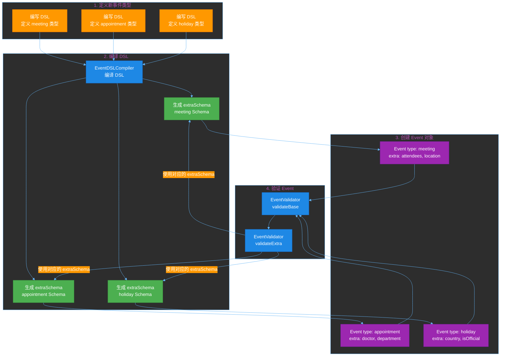
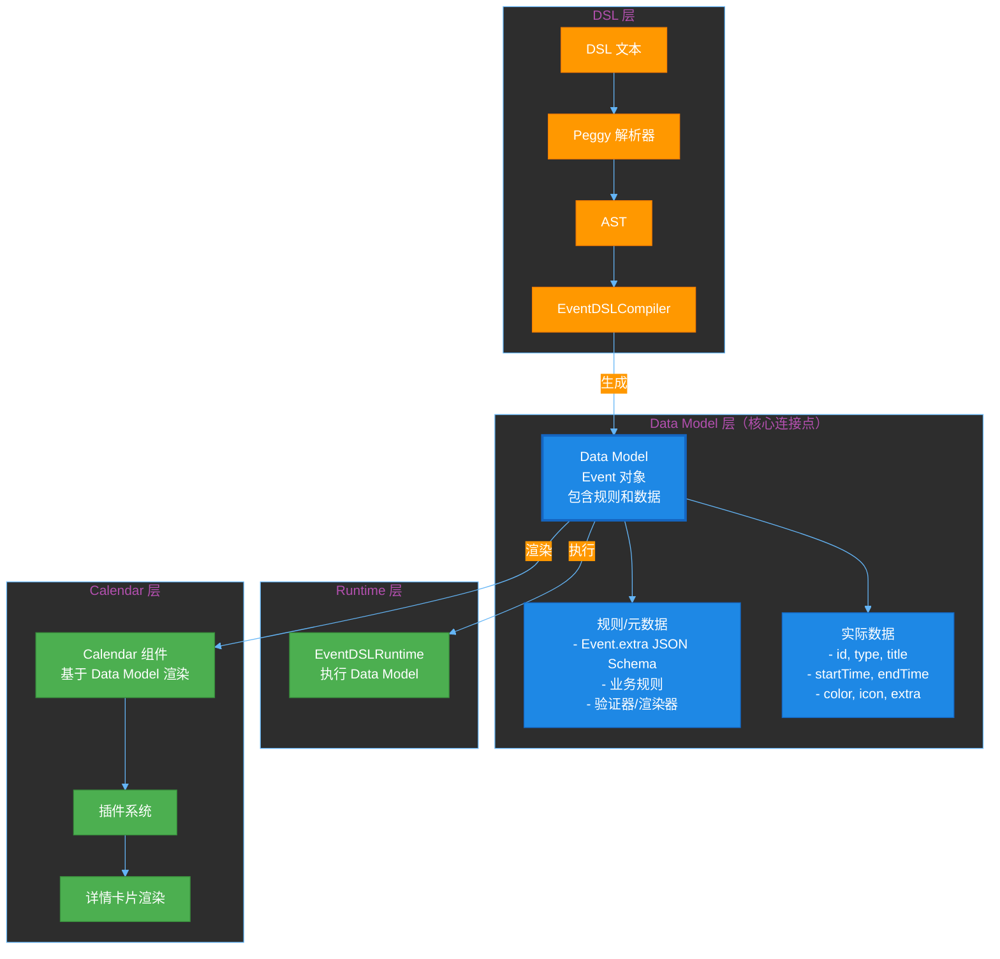
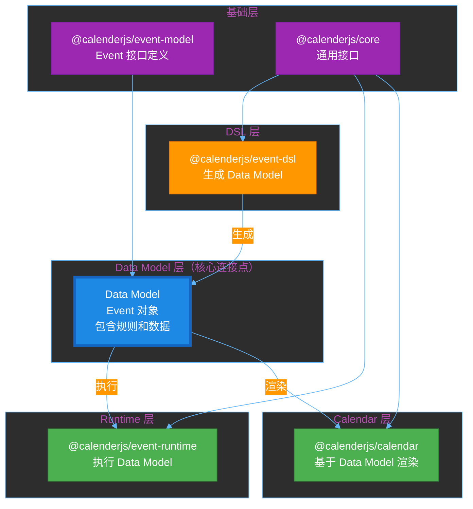

# RFC-0001: Event DSL (领域特定语言)

**状态**: Completed
**创建日期**: 2024-12-30
**完成日期**: 2026-01-XX
**作者**: WSX Team
**关联**: RFC-0009 (Calendar Component)

## 摘要

设计并实现 **Event DSL**（领域特定语言），一种声明式的、领域友好的配置语言，专为事件日历领域设计。Event DSL 使得非程序员也能理解和配置事件类型，用于定义事件的验证规则、显示规则和行为规则。

**核心创新**：Event DSL 是一种声明式的、领域友好的配置语言，专为事件日历领域设计，使得非程序员也能理解和配置事件类型。

**时间敏感活动支持**（核心功能）：
- ✅ 时区支持（IANA 时区标识符，如 "Asia/Shanghai"）
- ✅ 重复事件（daily/weekly/monthly/yearly，支持排除日期）
- ✅ 全天事件支持（allDay 字段）
- ✅ 时间精度控制（timePrecision 约束）
- ✅ 时间范围验证（allowedHours, allowedDays）
- ✅ 跨天事件支持（allowCrossDay, maxCrossDayDuration）
- ✅ 提前创建时间验证（minAdvanceTime, maxAdvanceTime）
- ✅ 时间冲突检测（no conflict with other events）

**开源定位**：
- **Event DSL**：开源配置语言（MIT协议）
- **@calenderjs/event-dsl**：DSL 解析器和运行时引擎（MIT协议）
- **商业应用**：Appointment Service 等业务服务可以基于此 DSL 构建（付费SaaS）

## 动机

### 为什么需要这个功能？

在事件管理、日程安排、项目管理等应用场景中，日历组件是一个核心需求。目前缺少一个功能完整、设计精美、且由领域语言驱动的开源日历组件。

### Event DSL 的必要性

**为什么不用 JavaScript/JSON 配置？**

1. **可读性差**：
   ```javascript
   // JavaScript配置 - 复杂难懂
   customValidation: (event, context) => {
     return event.extra.attendees.length >= 1 &&
            event.extra.attendees.length <= 50 &&
            event.startTime.getHours() >= 9 &&
            event.startTime.getHours() <= 18;
   }
   ```

2. **无法序列化**：JavaScript函数无法存储为JSON，无法通过API传输

3. **不适合非程序员**：产品经理、运营人员无法直接配置

**Event DSL 的优势**：

```dsl
# Event DSL - 声明式、易读
validate:
  attendees.count between 1 and 50
  startTime.hour between 9 and 18
  no conflict with other events
```

- ✅ 声明式、领域友好
- ✅ 完全可序列化（纯文本）
- ✅ 非程序员也能理解
- ✅ 专为事件领域设计

### 目标用户

- **应用开发者**：需要构建事件管理、日程安排等功能的开发者
- **配置管理员**：需要定义和管理事件类型的产品经理、运营人员
- **框架学习者**：希望学习 DSL 设计的开发者

### 事件类型扩展机制

**核心价值**：Event DSL 提供了一个声明式的方式来扩展 Event 数据模型，支持不同类型的事件（meeting, appointment, holiday, task 等），而无需修改核心 Event 接口。

**扩展原理**：
1. **Event 接口是固定的**：所有事件类型共享相同的基础结构（id, type, title, startTime, endTime, color, icon, extra, metadata）
2. **通过 `type` 字段区分**：不同事件类型通过 `Event.type` 字段区分（如 "meeting", "appointment", "holiday"）
3. **通过 `extra` 字段扩展**：每个事件类型特有的数据存储在 `Event.extra` 字段中
4. **通过 DSL 定义结构**：使用 DSL 的 `fields:` 部分定义每个事件类型的 `extra` 字段结构
5. **自动生成验证 Schema**：从 DSL `fields:` 自动生成 JSON Schema，用于验证 `Event.extra` 字段

**扩展流程**：



**示例：定义三种不同的事件类型**

**1. Meeting 事件类型**：

```dsl
type: meeting
name: 会议

fields:
  - title: string, required
  - attendees: list of email, required, min: 1, max: 50
  - location: string
  - priority: enum(low, normal, high), default: normal
  - organizer: email, required
  - agenda: text

validate:
  attendees.count between 1 and 50
  startTime.hour between 9 and 18
  no conflict with other events

display:
  color:
    when priority is high: "#ea4335"
    when priority is normal: "#4285f4"
    else: "#34a853"
  title: "{event.title}"
  description: "{attendees.count}人 · {location}"
```

**生成的 Event 对象**：

```typescript
const meetingEvent: Event = {
  id: "event-1",
  type: "meeting",  // ← 事件类型标识符
  title: "团队会议",
  startTime: new Date("2025-01-15T10:00:00"),
  endTime: new Date("2025-01-15T11:00:00"),
  color: "#4285f4",
  extra: {  // ← meeting 类型特有的数据
    title: "团队会议",
    attendees: ["user1@example.com", "user2@example.com"],
    location: "会议室 A",
    priority: "normal",
    organizer: "admin@example.com",
    agenda: "讨论项目进度"
  }
};
```

**2. Appointment 事件类型**：

```dsl
type: appointment
name: 预约

fields:
  - doctor: string, required
  - department: string, required
  - patientName: string, required
  - notes: text
  - insurance: boolean, default: false

validate:
  startTime.hour between 8 and 17
  duration between 15 minutes and 2 hours

display:
  color: "#fbbc04"
  title: "{doctor} - {patientName}"
  description: "{department}"
```

**生成的 Event 对象**：

```typescript
const appointmentEvent: Event = {
  id: "event-2",
  type: "appointment",  // ← 不同的事件类型
  title: "Dr. Smith - 张三",
  startTime: new Date("2025-01-15T14:00:00"),
  endTime: new Date("2025-01-15T15:00:00"),
  color: "#fbbc04",
  extra: {  // ← appointment 类型特有的数据（不同的结构）
    doctor: "Dr. Smith",
    department: "内科",
    patientName: "张三",
    notes: "带病历",
    insurance: false
  }
};
```

**3. Holiday 事件类型**：

```dsl
type: holiday
name: 节假日

fields:
  - name: string, required
  - country: string, default: "CN"
  - isOfficial: boolean, default: true
  - description: text

validate:
  name is not empty
  duration is 1 day
  allDay is true

display:
  color: "#ea4335"
  icon: "🎉"
  title: "{name}"
  description:
    when isOfficial is true:
      "法定节假日"
    else:
      "假期"
```

**生成的 Event 对象**：

```typescript
const holidayEvent: Event = {
  id: "event-3",
  type: "holiday",  // ← 不同的事件类型
  title: "春节",
  startTime: new Date("2025-01-29T00:00:00"),
  endTime: new Date("2025-02-04T23:59:59"),
  color: "#ea4335",
  icon: "🎉",
  allDay: true,
  extra: {  // ← holiday 类型特有的数据（完全不同的结构）
    name: "春节",
    country: "CN",
    isOfficial: true,
    description: "法定节假日"
  }
};
```

**扩展机制的优势**：

1. **无需修改核心接口**：添加新的事件类型（如 "task", "reminder"）只需编写 DSL，无需修改 Event 接口
2. **类型安全**：通过生成的 JSON Schema 和 TypeScript 类型，确保 `Event.extra` 字段的类型安全
3. **自动验证**：每个事件类型的 `extra` 字段自动使用对应的 Schema 验证
4. **声明式配置**：非程序员也能理解和配置事件类型
5. **灵活扩展**：可以随时添加新的事件类型，不影响现有类型

**使用流程**：

```typescript
// 1. 定义多个事件类型的 DSL
const meetingDSL = `type: meeting ...`;
const appointmentDSL = `type: appointment ...`;
const holidayDSL = `type: holiday ...`;

// 2. 解析和编译所有 DSL
const compiler = new EventDSLCompiler();
const meetingAST = parseEventDSL(meetingDSL);
const appointmentAST = parseEventDSL(appointmentDSL);
const holidayAST = parseEventDSL(holidayDSL);

const compiledDSL = compiler.compileFromAST([
  meetingAST,
  appointmentAST,
  holidayAST
]);

// 3. 获取每个类型的 extraSchema
const meetingSchema = compiledDSL.types.find(t => t.id === 'meeting')?.extraSchema;
const appointmentSchema = compiledDSL.types.find(t => t.id === 'appointment')?.extraSchema;
const holidaySchema = compiledDSL.types.find(t => t.id === 'holiday')?.extraSchema;

// 4. 验证不同类型的事件
const validator = new EventValidator();

// 验证 meeting 事件
const meetingEvent: Event = { type: 'meeting', extra: { attendees: [...] }, ... };
validator.validate(meetingEvent, meetingSchema);

// 验证 appointment 事件
const appointmentEvent: Event = { type: 'appointment', extra: { doctor: '...' }, ... };
validator.validate(appointmentEvent, appointmentSchema);

// 验证 holiday 事件
const holidayEvent: Event = { type: 'holiday', extra: { name: '...' }, ... };
validator.validate(holidayEvent, holidaySchema);
```

### 与 Calendar 组件的关系

**重要**：Event DSL 是生成工具，用于生成符合 Event Data Model 的数据。Event Data Model 是 SSOT（单一数据源），定义了 Event 接口结构（在 @calenderjs/event-model 中）。

**核心架构：Data Model 作为关键连接点**

Data Model 是自解释的，是连接所有组件的关键粘合剂：



**关键关系**：
1. **DSL 生成 Data Model**：DSL → EventDSLCompiler → Data Model
2. **Runtime 执行 Data Model**：EventDSLRuntime 使用 Data Model 中的规则进行验证
3. **Calendar 基于 Data Model 渲染**：Calendar 组件直接使用 Data Model 中的数据渲染

**架构关系：Data Model 作为关键连接点**

Data Model 是自解释的，是连接所有组件的关键粘合剂：

- ✅ **Data Model 是核心连接点**：Data Model = Event 对象（包含规则和数据），是自解释的，不需要额外的层
- ✅ **DSL 生成 Data Model**：DSL → EventDSLCompiler → Data Model
- ✅ **Runtime 执行 Data Model**：EventDSLRuntime 使用 Data Model 中的规则进行验证
- ✅ **Calendar 基于 Data Model 渲染**：Calendar 组件直接使用 Data Model 中的数据渲染
- ✅ **Data Model 包含**：
  - **规则/元数据**：
    - **Event.extra JSON Schema**（从 DSL fields 生成，用于运行时验证 Event.extra 结构）
    - 业务规则（用于验证业务逻辑）
    - 验证器/渲染器函数
  - **实际数据**：id, type, title, startTime, endTime, color, icon, extra, metadata
- ✅ **两个 JSON Schema（独立存在）**：
  1. **Event Data Model JSON Schema**（固定，在 `@calenderjs/event-model` 包中定义，**不包含在 Data Model 中**）：用于验证 Data Model（Event 对象）本身的结构
  2. **Event.extra JSON Schema**（从 DSL fields 生成，**包含在 Data Model 中**）：用于运行时验证 Event.extra 结构

**关键架构原则**：
1. **DSL 编译成 Data Model**：
   - DSL 文本 → 解析器 → AST
   - AST → EventDSLCompiler → 编译成 Data Model
  - Data Model 包含：
    - **Event.extra JSON Schema**（从 DSL fields 生成，用于运行时验证 Event.extra 结构）
    - 业务规则（从 DSL validate 部分生成，用于验证业务逻辑）
    - 验证器/渲染器函数
  - **两个 JSON Schema（独立存在）**：
    1. **Event Data Model JSON Schema**（固定，在 `@calenderjs/event-model` 包中定义，**不包含在 Data Model 中**）：用于验证 Data Model（Event 对象）本身的结构
    2. **Event.extra JSON Schema**（从 DSL fields 生成，**包含在 Data Model 中**）：用于运行时验证 Event.extra 结构
2. **两个 JSON Schema 的用途和位置**：
   - **Event Data Model JSON Schema**（固定，在 `@calenderjs/event-model` 包中定义，`EVENT_BASE_SCHEMA`）：
     - **位置**：`@calenderjs/event-model` 包中，**不包含在 Data Model 中**
     - **用途**：用于验证 Data Model（Event 对象）本身的结构
     - **验证字段**：id, type, title, startTime, endTime, color, icon, extra, metadata 等字段
     - **特点**：不随 DSL 变化，是固定的
   - **Event.extra JSON Schema**（从 DSL fields 生成）：
     - **位置**：从 DSL fields 生成，**包含在 Data Model 中**
     - **用途**：用于运行时验证 Event.extra 结构
     - **特点**：从 DSL fields 生成，随 DSL 类型不同而变化
     - **使用**：EventValidator 使用 Data Model 中的 Event.extra JSON Schema 验证
3. **运行时使用 Data Model**：
   - EventDSLRuntime 使用编译后的 Data Model 验证业务逻辑
   - 运行时不直接使用 AST，而是使用编译后的 Data Model
4. **运行时包依赖关系**：
   - **运行时应该依赖 Data Model，而不是 DSL**
   - 需要创建新包 `@calenderjs/event-runtime`，依赖 `@calenderjs/event-model`
   - 运行时包接收编译后的 Data Model（来自 DSL 编译），验证 Event 数据

## Event DSL 完整定义

### DSL 设计理念

**核心原则**：
1. **领域特定**：只包含事件日历领域需要的概念
2. **声明式**：描述"是什么"，而不是"怎么做"
3. **自然语言风格**：读起来像自然语言，而不是代码
4. **安全可控**：无副作用，沙箱执行
5. **时间敏感**：完整支持时区、重复事件、时间验证等时间相关特性

**不包含的功能**（保持简洁）：
- ❌ 循环（for/while）
- ❌ 函数定义
- ❌ 变量赋值
- ❌ 文件/网络访问

### DSL 语法规范

#### 1. 事件类型定义

```dsl
# ============================================
# Event Type Definition
# ============================================

type: meeting
name: 会议
description: 团队会议、客户会议等

# 字段定义
fields:
  - title: string, required
  - attendees: list of email, required
  - location: string
  - priority: enum(low, normal, high), default: normal
  - organizer: email, required
  - agenda: text

# 验证规则
validate:
  # 基础时间验证（自动包含）
  startTime before endTime
  duration >= minDuration
  duration <= maxDuration
  
  # 业务验证
  attendees.count between 1 and 50
  startTime.hour between 9 and 18
  duration between 15 minutes and 8 hours
  no conflict with other events

  # 时间精度验证
  when timePrecision is set:
    startTime.minute mod timePrecision is 0
    endTime.minute mod timePrecision is 0

  # 提前创建验证
  when minAdvanceTime is set:
    startTime after now plus minAdvanceTime
  when maxAdvanceTime is set:
    startTime before now plus maxAdvanceTime

  # 时区验证
  when timeZone is set:
    event.timeZone equals timeZone
  when allowedTimeZones is set:
    event.timeZone in allowedTimeZones

  # 条件验证
  when priority is high:
    attendees.count >= 5
    created before startTime minus 1 day

# 显示规则
display:
  color:
    when priority is high: "#ea4335"
    when priority is normal: "#4285f4"
    else: "#34a853"

  icon:
    when attendees.count > 20: "🏢"
    when priority is high: "🔥"
    else: "📅"

  title: "{event.title}"

  description:
    when attendees.count > 20:
      "大型会议: {attendees.count}人 · {location}"
    else:
      "{attendees.count}人 · {location}"

# 行为规则
behavior:
  draggable:
    when user.role is admin: true
    when user.email equals organizer: true
    else: false

  resizable: false

  editable:
    when startTime before now: false
    when user.role is admin: true
    when user.email equals organizer: true
    else: false

# 时间约束
constraints:
  minDuration: 15 minutes
  maxDuration: 8 hours
  allowedHours: 9 to 18
  allowedDays: monday to friday
  timeZone: "Asia/Shanghai"              # 事件时区（IANA 时区标识符）
  allowedTimeZones: ["Asia/Shanghai", "America/New_York"]  # 允许的时区列表
  timePrecision: 15 minutes              # 时间精度（只能按指定间隔）
  minAdvanceTime: 1 hour                 # 至少提前创建时间
  maxAdvanceTime: 30 days                # 最多提前创建时间
  allowCrossDay: true                    # 允许跨天事件
  maxCrossDayDuration: 7 days           # 最大跨天时长
```

#### 2. 数据访问语法

```dsl
# 访问事件字段
event.title
event.extra.attendees    # 访问 extra 字段中的 attendees
attendees.count          # 简写形式（在event上下文中，自动查找 event.extra.attendees）
startTime.hour
startTime.minute
startTime.day
endTime.hour
duration                 # 自动计算（endTime - startTime）

# 访问用户信息
user.email
user.role
user.id
user.vipLevel

# 访问时间
now                      # 当前时间
created                  # 事件创建时间
startTime.date          # 开始日期（不含时间）
endTime.date            # 结束日期（不含时间）
startTime.dayOfWeek     # 星期几（0=周日，1=周一...）
endTime.dayOfWeek       # 星期几
startTime.timeZone      # 时区信息
```

#### 3. 比较运算

```dsl
# 相等/不等
priority is high
priority is not low
user.role equals admin
user.role not equals guest

# 范围
attendees.count between 1 and 50
startTime.hour between 9 and 18
priority in (low, normal, high)

# 大小比较
attendees.count > 20
attendees.count >= 5
duration < 2 hours
```

#### 4. 逻辑运算

```dsl
# 与（and）
attendees.count > 0 and attendees.count <= 50
user.role is admin and event.priority is high

# 或（or）
user.role is admin or user.email equals organizer
priority is high or attendees.count > 20

# 非（not/no）
not user.role equals guest
no conflict with other events
```

#### 5. 条件表达式

```dsl
# when-else 结构
when condition:
  expression
else:
  expression

# 示例
when priority is high:
  "#ea4335"
else:
  "#4285f4"

# 多条件
when priority is high:
  attendees.count >= 5
  duration >= 1 hour
when priority is normal:
  attendees.count >= 1
else:
  true
```

#### 6. 时间和时长

```dsl
# 时长字面量
15 minutes
2 hours
1 day
1 week

# 时间比较
startTime before now
startTime after now
created before startTime minus 1 day
endTime after startTime plus 30 minutes
startTime.date equals "2025-01-15"        # 日期比较
endTime.date after startTime.date       # 日期比较
startTime.dayOfWeek in [1, 2, 3, 4, 5]  # 工作日验证
startTime.dayOfWeek in [0, 6]           # 周末验证

# 时间运算
startTime minus 1 day
endTime plus 2 hours
now minus 1 week
startTime plus 1 hour                   # 相对时间
now plus minAdvanceTime                 # 使用约束中的值

# 时间字符串比较
startTime between "09:00" and "18:00"  # 时间范围
startTime equals "10:30"                 # 精确时间
```

#### 7. 字符串模板

```dsl
# 使用 {} 插值
"{attendees.count}人参与"
"大型会议: {attendees.count}人 · {location}"
"{user.name} 创建的 {event.title}"

# 条件模板
when attendees.count > 20:
  "大型会议: {attendees.count}人"
else:
  "{attendees.count}人"
```

#### 8. 重复事件规则

```dsl
# 重复规则定义
recurring:
  frequency: daily | weekly | monthly | yearly
  interval: 1                    # 每 N 个周期
  endDate: "2025-12-31"           # 结束日期
  count: 10                        # 或重复次数
  daysOfWeek: [1, 3, 5]           # 每周一、三、五（0=周日）
  dayOfMonth: 15                  # 每月第 15 天
  excludeDates: ["2025-01-01"]    # 排除的日期
  timeZone: "Asia/Shanghai"       # 重复事件时区

# 重复事件验证
validate:
  when recurring is set:
    recurring.endDate after startTime or recurring.count > 0
    when recurring.frequency is weekly:
      recurring.daysOfWeek is not empty
    when recurring.frequency is monthly:
      recurring.dayOfMonth between 1 and 31
```

#### 9. 内置函数

```dsl
# 冲突检测
no conflict with other events
conflict with other events

# 列表操作
attendees.count
attendees contains "admin@example.com"
attendees.first
attendees.last

# 字符串操作
title contains "重要"
location starts with "会议室"

# 时间操作
isBusinessDay(date)               # 是否为工作日
isWeekend(date)                   # 是否为周末
daysBetween(date1, date2)         # 计算天数差
```

### 完整语法示例

#### 示例1：会议事件类型

```dsl
type: meeting
name: 会议

fields:
  - title: string, required
  - attendees: list of email, required, min: 1, max: 50
  - location: string
  - priority: enum(low, normal, high), default: normal
  - organizer: email, required

validate:
  # 基础时间验证
  startTime before endTime
  duration between 15 minutes and 8 hours
  
  # 业务验证
  attendees.count between 1 and 50
  startTime.hour between 9 and 18
  no conflict with other events

  when priority is high:
    attendees.count >= 5
    created before startTime minus 1 day

display:
  color:
    when priority is high: "#ea4335"
    when priority is normal: "#4285f4"
    else: "#34a853"

  icon:
    when attendees.count > 20: "🏢"
    when priority is high: "🔥"
    else: "📅"

  title: "{event.title}"
  description: "{attendees.count}人 · {location}"

behavior:
  draggable: user.role is admin or user.email equals organizer
  resizable: false
  editable: startTime after now and (user.role is admin or user.email equals organizer)
  deletable: user.role is admin or user.email equals organizer

constraints:
  minDuration: 15 minutes
  maxDuration: 8 hours
  allowedHours: 9 to 18
  allowedDays: monday to friday
  timeZone: "Asia/Shanghai"
  timePrecision: 15 minutes
```

#### 示例2：重复会议事件类型

```dsl
type: weekly-meeting
name: 周例会

fields:
  - title: string, required
  - attendees: list of email, required
  - location: string

validate:
  startTime before endTime
  duration between 30 minutes and 2 hours
  startTime.dayOfWeek in [1, 3, 5]  # 每周一、三、五

display:
  color: "#4285f4"
  icon: "📅"
  title: "{title}"
  description: "周例会 · {location}"

behavior:
  draggable: false
  resizable: false
  editable: user.role is admin
  deletable: user.role is admin

constraints:
  minDuration: 30 minutes
  maxDuration: 2 hours
  allowedDays: monday, wednesday, friday

# 重复规则
recurring:
  frequency: weekly
  interval: 1
  daysOfWeek: [1, 3, 5]          # 每周一、三、五
  endDate: "2025-12-31"
  timeZone: "Asia/Shanghai"
```

#### 示例3：节假日事件类型

```dsl
type: holiday
name: 节假日

fields:
  - name: string, required
  - country: string, default: "CN"
  - isOfficial: boolean, default: true

validate:
  name is not empty
  duration is 1 day
  allDay is true  # 节假日通常是全天事件

display:
  color: "#ea4335"
  icon: "🎉"
  title: "{name}"
  description:
    when isOfficial is true:
      "法定节假日"
    else:
      "假期"

behavior:
  draggable: false
  resizable: false
  editable: user.role is admin
  deletable: user.role is admin
```

#### 示例4：任务事件类型

```dsl
type: task
name: 任务

fields:
  - title: string, required
  - status: enum(todo, doing, done), default: todo
  - priority: enum(low, normal, high), default: normal
  - assignee: email

validate:
  title is not empty
  duration >= 15 minutes

display:
  color:
    when status is done: "#34a853"
    when status is doing: "#fbbc04"
    else: "#9e9e9e"

  icon:
    when status is done: "✓"
    when status is doing: "⏳"
    else: "◯"

  title: "{title}"
  description:
    when status is done:
      "已完成"
    when status is doing:
      "进行中 · {priority}"
    else:
      "待办 · {priority}"

behavior:
  draggable: true
  resizable: true
  editable: user.email equals assignee or user.role is admin
  deletable: user.email equals assignee or user.role is admin
```

## Peggy 语法定义

### 完整 Peggy 语法文件

文件：`packages/dsl/src/parser/event-dsl.pegjs`

```peggy
{
  // 辅助函数
  function buildBinaryExpression(head, tail) {
    return tail.reduce((left, [op, right]) => ({
      type: 'BinaryExpression',
      operator: op,
      left: left,
      right: right
    }), head);
  }
}

// ============================================
// 顶层规则
// ============================================

EventTypeDefinition
  = _ sections:Section+ _ {
      const result = {};
      sections.forEach(section => {
        result[section.name] = section.value;
      });
      return result;
    }

Section
  = TypeSection
  / NameSection
  / DescriptionSection
  / FieldsSection
  / ValidateSection
  / DisplaySection
  / BehaviorSection
  / ConstraintsSection

// ============================================
// 基本信息部分
// ============================================

TypeSection
  = "type:" _ value:Identifier _ {
      return { name: 'type', value: value };
    }

NameSection
  = "name:" _ value:String _ {
      return { name: 'name', value: value };
    }

DescriptionSection
  = "description:" _ value:String _ {
      return { name: 'description', value: value };
    }

// ============================================
// 字段定义部分
// ============================================

FieldsSection
  = "fields:" _ fields:FieldDefinition+ {
      return { name: 'fields', value: fields };
    }

FieldDefinition
  = _ "-" _ name:Identifier ":" _ type:FieldType modifiers:FieldModifier* _ {
      return {
        name: name,
        type: type,
        ...Object.assign({}, ...modifiers)
      };
    }

FieldType
  = "string"
  / "number"
  / "boolean"
  / "email"
  / "text"
  / "list of " type:FieldType { return { type: 'list', itemType: type }; }
  / "enum(" values:EnumValues ")" { return { type: 'enum', values: values }; }

EnumValues
  = head:Identifier tail:("," _ value:Identifier { return value; })* {
      return [head, ...tail];
    }

FieldModifier
  = "," _ "required" { return { required: true }; }
  / "," _ "default:" _ value:Literal { return { default: value }; }
  / "," _ "min:" _ value:Number { return { min: value }; }
  / "," _ "max:" _ value:Number { return { max: value }; }

// ============================================
// 验证规则部分
// ============================================

ValidateSection
  = "validate:" _ rules:ValidationRule+ {
      return { name: 'validate', value: rules };
    }

ValidationRule
  = _ WhenExpression
  / _ ComparisonExpression _

WhenExpression
  = "when" _ condition:LogicalExpression ":" _ rules:ValidationRule+ {
      return {
        type: 'When',
        condition: condition,
        rules: rules
      };
    }

ComparisonExpression
  = BetweenExpression
  / RangeExpression
  / ConflictExpression
  / LogicalExpression

BetweenExpression
  = field:FieldAccess _ "between" _ min:Literal _ "and" _ max:Literal {
      return {
        type: 'Between',
        field: field,
        min: min,
        max: max
      };
    }

RangeExpression
  = field:FieldAccess _ operator:ComparisonOperator _ value:Literal {
      return {
        type: 'Comparison',
        operator: operator,
        left: field,
        right: value
      };
    }

ConflictExpression
  = "no" _ "conflict" _ "with" _ "other" _ "events" {
      return { type: 'NoConflict' };
    }
  / "conflict" _ "with" _ "other" _ "events" {
      return { type: 'Conflict' };
    }

LogicalExpression
  = head:LogicalTerm tail:(_ operator:("and" / "or") _ right:LogicalTerm {
      return [operator, right];
    })* {
      return buildBinaryExpression(head, tail);
    }

LogicalTerm
  = "not" _ expr:ComparisonTerm {
      return { type: 'UnaryExpression', operator: 'not', argument: expr };
    }
  / ComparisonTerm

ComparisonTerm
  = left:FieldAccess _ operator:("is" / "equals" / "is not" / "not equals" / ">" / ">=" / "<" / "<=") _ right:Literal {
      return {
        type: 'Comparison',
        operator: operator,
        left: left,
        right: right
      };
    }
  / FieldAccess

// ============================================
// 显示规则部分
// ============================================

DisplaySection
  = "display:" _ rules:DisplayRule+ {
      return { name: 'display', value: rules };
    }

DisplayRule
  = _ name:("color" / "icon" / "title" / "description") ":" _ value:DisplayValue _ {
      return { name: name, value: value };
    }

DisplayValue
  = WhenDisplayExpression
  / StringTemplate
  / String

WhenDisplayExpression
  = "when" _ condition:LogicalExpression ":" _ value:DisplayValue rest:(_ "else:" _ value:DisplayValue { return value; })? {
      return {
        type: 'Conditional',
        condition: condition,
        consequent: value,
        alternate: rest
      };
    }

// ============================================
// 行为规则部分
// ============================================

BehaviorSection
  = "behavior:" _ rules:BehaviorRule+ {
      return { name: 'behavior', value: rules };
    }

BehaviorRule
  = _ name:("draggable" / "resizable" / "editable" / "deletable") ":" _ value:BehaviorValue _ {
      return { name: name, value: value };
    }

BehaviorValue
  = LogicalExpression
  / Boolean

// ============================================
// 约束部分
// ============================================

ConstraintsSection
  = "constraints:" _ constraints:ConstraintRule+ {
      return { name: 'constraints', value: constraints };
    }

ConstraintRule
  = _ name:Identifier ":" _ value:Literal _ {
      return { name: name, value: value };
    }

// ============================================
// 字段访问
// ============================================

FieldAccess
  = head:Identifier tail:("." property:Identifier { return property; })* {
      return {
        type: 'FieldAccess',
        path: [head, ...tail]
      };
    }

// ============================================
// 字面量
// ============================================

Literal
  = Duration
  / Number
  / String
  / Boolean
  / Identifier

Duration
  = value:Number _ unit:("minutes" / "hours" / "days" / "weeks") {
      return {
        type: 'Duration',
        value: value,
        unit: unit
      };
    }

Number
  = digits:[0-9]+ {
      return parseInt(digits.join(''), 10);
    }

String
  = '"' chars:[^"]* '"' {
      return chars.join('');
    }

StringTemplate
  = '"' parts:TemplatePart+ '"' {
      return {
        type: 'Template',
        parts: parts
      };
    }

TemplatePart
  = "{" field:FieldAccess "}" { return field; }
  / chars:[^{}]+ { return chars.join(''); }

Boolean
  = "true" { return true; }
  / "false" { return false; }

Identifier
  = chars:[a-zA-Z_][a-zA-Z0-9_]* {
      return chars.flat().join('');
    }

ComparisonOperator
  = ">=" / "<=" / ">" / "<" / "is" / "equals" / "is not" / "not equals"

// ============================================
// 空白和注释
// ============================================

_
  = (WhiteSpace / Comment)*

WhiteSpace
  = [ \t\n\r]

Comment
  = "#" [^\n]*
```

### AST 类型定义

文件：`packages/dsl/src/ast/types.ts`

```typescript
/**
 * Event DSL AST 类型定义
 */

export interface EventTypeAST {
  type: string;
  name: string;
  description?: string;
  fields: FieldDefinition[];
  validate: ValidationRule[];
  display: DisplayRule[];
  behavior: BehaviorRule[];
  constraints?: ConstraintRule[];
}

export interface FieldDefinition {
  name: string;
  type: FieldType;
  required?: boolean;
  default?: any;
  min?: number;
  max?: number;
}

export type FieldType =
  | 'string'
  | 'number'
  | 'boolean'
  | 'email'
  | 'text'
  | { type: 'list'; itemType: FieldType }
  | { type: 'enum'; values: string[] };

export type ValidationRule =
  | BetweenRule
  | ComparisonRule
  | ConflictRule
  | WhenRule
  | LogicalRule;

export interface BetweenRule {
  type: 'Between';
  field: FieldAccess;
  min: any;
  max: any;
}

export interface ComparisonRule {
  type: 'Comparison';
  operator: string;
  left: FieldAccess;
  right: any;
}

export interface ConflictRule {
  type: 'NoConflict' | 'Conflict';
}

export interface WhenRule {
  type: 'When';
  condition: Expression;
  rules: ValidationRule[];
}

export interface LogicalRule {
  type: 'BinaryExpression' | 'UnaryExpression';
  operator: 'and' | 'or' | 'not';
  left?: Expression;
  right?: Expression;
  argument?: Expression;
}

export interface FieldAccess {
  type: 'FieldAccess';
  path: string[];
}

export type Expression = any; // 可以是各种表达式类型

export interface DisplayRule {
  name: 'color' | 'icon' | 'title' | 'description';
  value: string | ConditionalValue | TemplateValue;
}

export interface ConditionalValue {
  type: 'Conditional';
  condition: Expression;
  consequent: any;
  alternate?: any;
}

export interface TemplateValue {
  type: 'Template';
  parts: Array<string | FieldAccess>;
}

export interface BehaviorRule {
  name: 'draggable' | 'resizable' | 'editable' | 'deletable';
  value: boolean | Expression;
}

export interface ConstraintRule {
  name: string;
  value: any;
}
```

## 包架构与数据模型

### 包结构

CalenderJS 采用 monorepo 结构，分为两个核心包：

```
packages/
├── core/              @calenderjs/core
│   └── 通用接口和上下文
│
├── event-model/       @calenderjs/event-model
│   └── Event 数据模型（SSOT）
│
├── event-dsl/         @calenderjs/event-dsl
│   └── DSL解析和编译（编译成 Data Model）
│
├── event-runtime/     @calenderjs/event-runtime (新包)
│   └── 运行时验证（使用编译后的 Data Model）
│
└── calendar/         @calenderjs/calendar
    └── Calendar 组件（基于 WSX，必需）
```

**依赖关系：Data Model 作为核心连接点**



**说明**：
- **Data Model 是核心连接点**：Data Model = Event 对象（包含规则和数据），是自解释的，连接所有组件
- **DSL 生成 Data Model**：`@calenderjs/event-dsl` 编译 DSL → Data Model
- **Runtime 执行 Data Model**：`@calenderjs/event-runtime` 使用 Data Model 中的规则进行验证
- **Calendar 基于 Data Model 渲染**：`@calenderjs/calendar` 直接使用 Data Model 中的数据渲染
- **基础层**：
  - `@calenderjs/event-model` 定义 Event 接口（SSOT）
  - `@calenderjs/core` 提供通用接口（User、Context 等）

### Event Data Model 包：SSOT（单一数据源）

**重要架构变更**：Event 接口定义已迁移到 `@calenderjs/event-model` 包，作为 SSOT（单一数据源）。

`@calenderjs/event-model` 定义所有包共享的核心接口和数据模型：
- Event 接口定义（`Event.ts`）
- Event JSON Schema（`validator.ts` 中的 `EVENT_BASE_SCHEMA`）
- Event 验证器（`EventValidator` 类）

所有其他包（`@calenderjs/core`、`@calenderjs/calendar`、`@calenderjs/event-dsl`）都应依赖 `@calenderjs/event-model`。

#### Event 验证架构（两部分验证）

**重要**：Event 验证分为两个独立的部分：

1. **验证 Event 数据模型**（使用预定义的标准 JSON Schema）
   - **Schema 位置**：`@calenderjs/event-model/src/validator.ts` 中的 `EVENT_BASE_SCHEMA`
   - **验证方法**：`EventValidator.validateBase(event)`
   - **验证内容**：Event 对象的基础结构
     - 必需字段：`id`, `type`, `title`, `startTime`, `endTime`
     - 可选字段：`color`, `icon`, `extra`, `metadata`
     - 字段类型和格式验证（如 `startTime` 必须是 ISO 8601 格式的日期时间字符串）
   - **特点**：
     - 固定的、预定义的 Schema
     - 不随 DSL 变化
     - 适用于所有 Event 类型

2. **验证 Event.extra 字段**（使用从 DSL 生成的 JSON Schema）
   - **Schema 来源**：从 DSL `fields:` 部分生成（通过 `EventDSLCompiler`）
   - **验证方法**：`EventValidator.validateExtra(event, extraSchema)`
   - **验证内容**：Event.extra 字段的结构和内容
     - 字段类型（string, number, boolean, email, list, enum 等）
     - 必需字段（required）
     - 字段约束（min, max, default 等）
   - **特点**：
     - 动态生成的 Schema
     - 随 DSL 类型不同而变化
     - 每个事件类型（meeting, appointment, holiday 等）有不同的 extra Schema

**验证流程示例**：

```typescript
import { EventValidator } from '@calenderjs/event-model';
import { EventDSLCompiler } from '@calenderjs/event-dsl';

// 1. 编译 DSL 生成 extra Schema
const compiler = new EventDSLCompiler();
const compiledDSL = compiler.compile(dslText);
const extraSchema = compiledDSL.types[0].extraSchema; // 从 DSL fields 生成的 JSON Schema

// 2. 创建验证器
const validator = new EventValidator();

// 3. 验证 Event 对象
const event: Event = {
  id: 'event-1',
  type: 'meeting',
  title: '团队会议',
  startTime: new Date('2025-01-15T10:00:00'),
  endTime: new Date('2025-01-15T11:00:00'),
  extra: {
    attendees: ['user1@example.com', 'user2@example.com'],
    location: '会议室 A',
  },
};

// 第一部分：验证 Event 数据模型（使用预定义的 EVENT_BASE_SCHEMA）
const baseResult = validator.validateBase(event);
if (!baseResult.valid) {
  console.error('基础结构验证失败:', baseResult.errors);
  return;
}

// 第二部分：验证 Event.extra 字段（使用从 DSL 生成的 extraSchema）
const extraResult = validator.validateExtra(event, extraSchema);
if (!extraResult.valid) {
  console.error('extra 字段验证失败:', extraResult.errors);
  return;
}

// 或者使用便捷方法（自动执行两部分验证）
const fullResult = validator.validate(event, extraSchema);
if (!fullResult.valid) {
  console.error('验证失败:', fullResult.errors);
}
```

**验证器方法说明**：

- `validateBase(event)`：只验证 Event 基础结构（第一部分）
- `validateExtra(event, extraSchema)`：先验证基础结构，再验证 extra 字段（两部分都验证）
- `validate(event, extraSchema?)`：便捷方法
  - 如果提供了 `extraSchema`，执行两部分验证（等同于 `validateExtra`）
  - 如果没有提供 `extraSchema`，只执行第一部分验证（等同于 `validateBase`）

### Core 包：通用接口和上下文

`@calenderjs/core` 提供通用接口和上下文定义（不包含 Event 接口）。

#### Event 接口

**重要**：Event 接口定义在 `@calenderjs/event-model` 包中，作为 SSOT（单一数据源）。以下为完整定义：

```typescript
/**
 * 事件核心接口（时间敏感活动）
 * 
 * 定义在 @calenderjs/event-model 包中
 * 
 * Event 是日历系统中的核心数据模型，表示一个**时间敏感的活动**。
 * 
 * **重要设计原则**：
 * 1. **Calendar 只关心 Event** - Calendar 组件处理的是 Event（时间敏感的活动）
 * 2. **Event 必须有时间** - Event 必须有 startTime 和 endTime
 * 3. **Appointment 和 Holiday 都是 Event 的扩展** - 它们都是 Event，只是 `type` 不同
 * 4. **Event 包含 Calendar 需要的数据** - Event 数据模型包含 Calendar 显示所需的核心字段
 * 5. **扩展属性用于详情卡片** - Event 的 `extra` 字段存储详情卡片数据
 */
export interface Event {
  /** 唯一标识符 */
  id: string;
  
  /** 
   * 事件类型标识符
   * 例如: "meeting", "appointment", "holiday", "task", "reminder" 等
   */
  type: string;
  
  /** 事件标题（Calendar 显示用） */
  title: string;
  
  /** 开始时间（必需 - Event 必须有时间） */
  startTime: Date;
  
  /** 结束时间（必需 - Event 必须有时间） */
  endTime: Date;
  
  /** 
   * 时区（IANA 时区标识符，如 "Asia/Shanghai"）
   * 用于跨时区事件处理和夏令时转换
   */
  timeZone?: string;
  
  /** 
   * 是否全天事件
   * 全天事件不受时区影响，通常从 00:00 到 23:59
   */
  allDay?: boolean;
  
  /** 
   * 重复规则
   * 定义事件的重复模式（daily/weekly/monthly/yearly）
   */
  recurring?: RecurringRule;
  
  /** 
   * 父事件 ID（如果是重复事件的实例）
   * 指向原始重复事件定义
   */
  parentEventId?: string;
  
  /** 
   * 重复实例 ID（用于标识重复序列中的特定实例）
   * 用于唯一标识重复事件序列中的某个实例
   */
  recurrenceId?: string;
  
  /** 
   * Calendar 显示属性（可选）
   * 用于控制 Calendar 中事件的显示样式
   */
  color?: string;
  icon?: string;
  
  /** 
   * 扩展属性（可选）
   * 用于存储事件详情卡片需要的数据
   * 这些数据由 Event DSL 定义，用于显示事件详情
   * 
   * 例如：
   * - `type: "meeting"` → `extra: { attendees, location, agenda }`
   * - `type: "appointment"` → `extra: { doctor, department, notes }`
   * - `type: "holiday"` → `extra: { country, isOfficial, description }`
   */
  extra?: Record<string, any>;
  
  /** 事件元数据（可选） */
  metadata?: EventMetadata;
}

/**
 * 重复规则
 */
export interface RecurringRule {
  /** 频率 */
  frequency: 'daily' | 'weekly' | 'monthly' | 'yearly';
  /** 间隔（如每 2 周） */
  interval: number;
  /** 结束日期 */
  endDate?: Date;
  /** 重复次数 */
  count?: number;
  /** 星期几（0=周日，1=周一...） */
  daysOfWeek?: number[];
  /** 每月第几天 */
  dayOfMonth?: number;
  /** 排除的日期列表 */
  excludeDates?: Date[];
  /** 时区（重复事件应保持在同一时区） */
  timeZone?: string;
}

export interface EventMetadata {
  createdAt: Date;
  updatedAt: Date;
  createdBy?: string;
  updatedBy?: string;
  version?: number;
}
```

#### User 接口

```typescript
/**
 * 用户接口（用于权限验证）
 */
export interface User {
  id: string;
  email: string;
  name?: string;
  role: UserRole;
  vipLevel?: number;
  [key: string]: any;
}

export type UserRole = 'admin' | 'user' | 'guest' | string;
```

#### Context 接口

```typescript
/**
 * 验证上下文
 */
export interface ValidationContext {
  user?: User;
  events: Event[];  // 用于冲突检测
  now: Date;
  [key: string]: any;
}

/**
 * 渲染上下文
 */
export interface RenderContext {
  user?: User;
  theme?: 'light' | 'dark';
  locale?: string;
  [key: string]: any;
}
```

#### EventType 接口

```typescript
/**
 * 事件类型定义接口
 */
export interface EventTypeDefinition {
  type: string;
  name: string;
  description?: string;
  schema: JSONSchema;        // 用于运行时验证
  validate?: (event: Event, context: ValidationContext) => ValidationResult;
  render?: (event: Event, context: RenderContext) => RenderedEvent;
  canPerform?: (action: string, event: Event, user: User) => boolean;
}

export interface JSONSchema {
  $schema?: string;
  type: 'object' | 'array' | 'string' | 'number' | 'boolean';
  properties?: Record<string, any>;
  required?: string[];
  additionalProperties?: boolean;
  [key: string]: any;
}

export interface ValidationResult {
  valid: boolean;
  errors?: string[];
}

export interface RenderedEvent {
  title: string;
  color: string;
  icon?: string;
  description?: string;
}
```

### Event-DSL 包：DSL 解析和编译

`@calenderjs/event-dsl` 依赖 `@calenderjs/event-model` 和 `@calenderjs/core`，提供 DSL 解析和编译功能。

#### 包结构

```
packages/event-dsl/
├── src/
│   ├── parser/           # DSL解析器
│   │   ├── event-dsl.pegjs
│   │   └── parse.ts
│   ├── ast/              # AST类型定义
│   │   └── types.ts
│   ├── compiler/         # DSL编译器
│   │   └── EventDSLCompiler.ts
│   └── generators/       # 数据生成器
│       └── EventDataGenerator.ts
└── package.json
```

**注意**：运行时已移到新包 `@calenderjs/event-runtime`。

### Event-Runtime 包：运行时验证（新包）

`@calenderjs/event-runtime` 依赖 `@calenderjs/event-model` 和 `@calenderjs/core`，**不依赖 DSL 包**。

#### 包结构

```
packages/event-runtime/
├── src/
│   └── EventDSLRuntime.ts  # 运行时引擎（使用编译后的 Data Model）
└── package.json
```

**职责**：
- 接收编译后的 Data Model（来自 DSL 编译）
- 使用 Data Model 中的业务规则验证 Event 数据
- 不依赖 DSL 包，只依赖 Data Model 包

#### 主要导出

```typescript
// 解析器
export function parseEventDSL(dslText: string): EventTypeAST;

// 生成器
export function generateJSONSchema(ast: EventTypeAST): JSONSchema;
export function generateTypeScript(ast: EventTypeAST): string;

// 运行时
export class EventDSLRuntime {
  validate(event: Event, context: ValidationContext): ValidationResult;
  render(event: Event, context: RenderContext): RenderedEvent;
  canPerform(action: string, event: Event, user: User): boolean;
}
```

## 完整数据流程

### DSL → JSON Data Model

```
┌─────────────────────────────────────────────────────────────┐
│ Step 1: 编写 DSL                                             │
└─────────────────────────────────────────────────────────────┘
                          ↓
    type: meeting
    fields:
      - title: string, required
      - attendees: list of email, required
                          ↓
┌─────────────────────────────────────────────────────────────┐
│ Step 2: Peggy Parser 解析                                    │
│ parseEventDSL(dslText)                                       │
└─────────────────────────────────────────────────────────────┘
                          ↓
┌─────────────────────────────────────────────────────────────┐
│ Step 3: 生成 AST (已经是JSON格式!)                            │
│ {                                                            │
│   type: "meeting",                                           │
│   fields: [                                                  │
│     { name: "title", type: "string", required: true },      │
│     { name: "attendees", type: {...}, required: true }      │
│   ]                                                          │
│ }                                                            │
└─────────────────────────────────────────────────────────────┘
                          ↓
            ┌─────────────┴─────────────┐
            ↓                           ↓
┌─────────────────────┐     ┌─────────────────────┐
│ Step 4a:            │     │ Step 4b:            │
│ 生成 JSON Schema     │     │ 生成 TypeScript      │
│ (运行时验证)         │     │ (开发时类型)         │
│                     │     │                     │
│ generateJSONSchema  │     │ generateTypeScript  │
│                     │     │                     │
│ {                   │     │ export interface    │
│   type: "object",   │     │ MeetingEventData {  │
│   properties: {...} │     │   title: string;    │
│ }                   │     │   attendees: string;│
└─────────────────────┘     └─────────────────────┘
```

### DSL 类型映射表

#### DSL → JSON Schema 映射

| DSL 类型 | JSON Schema |
|---------|-------------|
| `string` | `{"type": "string"}` |
| `number` | `{"type": "number"}` |
| `boolean` | `{"type": "boolean"}` |
| `email` | `{"type": "string", "format": "email"}` |
| `text` | `{"type": "string"}` |
| `list of T` | `{"type": "array", "items": {...}}` |
| `enum(a,b,c)` | `{"type": "string", "enum": ["a","b","c"]}` |

#### DSL → TypeScript 映射

| DSL 类型 | TypeScript |
|---------|-----------|
| `string` | `string` |
| `number` | `number` |
| `boolean` | `boolean` |
| `email` | `string` (注释: email format) |
| `text` | `string` |
| `list of T` | `T[]` |
| `enum(a,b,c)` | `'a' \| 'b' \| 'c'` |

#### 字段修饰符映射

| DSL 修饰符 | JSON Schema | TypeScript |
|-----------|-------------|-----------|
| `required` | `"required": ["fieldName"]` | `fieldName: Type` (非可选) |
| 无 required | 不在 required 数组 | `fieldName?: Type` (可选) |
| `default: value` | `"default": value` | `/** @default value */` |
| `min: n` | `"minItems": n` 或 `"minimum": n` | `/** @min n */` |
| `max: n` | `"maxItems": n` 或 `"maximum": n` | `/** @max n */` |

### 生成示例对比

**输入 DSL**：
```dsl
type: meeting
name: 会议

fields:
  - title: string, required
  - attendees: list of email, required, min: 1, max: 50
  - priority: enum(low, normal, high), default: normal
```

**输出 AST (JSON)**：
```json
{
  "type": "meeting",
  "name": "会议",
  "fields": [
    { "name": "title", "type": "string", "required": true },
    {
      "name": "attendees",
      "type": { "type": "list", "itemType": "email" },
      "required": true,
      "min": 1,
      "max": 50
    },
    {
      "name": "priority",
      "type": { "type": "enum", "values": ["low", "normal", "high"] },
      "default": "normal"
    }
  ]
}
```

**输出 JSON Schema**：
```json
{
  "$schema": "http://json-schema.org/draft-07/schema#",
  "type": "object",
  "title": "会议",
  "properties": {
    "title": { "type": "string" },
    "attendees": {
      "type": "array",
      "items": { "type": "string", "format": "email" },
      "minItems": 1,
      "maxItems": 50
    },
    "priority": {
      "type": "string",
      "enum": ["low", "normal", "high"],
      "default": "normal"
    }
  },
  "required": ["title", "attendees"]
}
```

**输出 TypeScript**：
```typescript
export interface MeetingEventData {
  title: string;

  /**
   * @minItems 1
   * @maxItems 50
   */
  attendees: string[];  // email format

  /** @default "normal" */
  priority?: 'low' | 'normal' | 'high';
}
```

## DSL 运行时引擎

### 核心架构

```
DSL Text (String)
    ↓
Peggy Parser
    ↓
AST (JSON格式)
    ↓
    ├─→ generateJSONSchema() → schema.json  (运行时)
    ├─→ generateTypeScript()  → types.ts    (开发时)
    └─→ EventDSLRuntime      → 验证/渲染/权限
```

### 运行时接口

文件：`packages/event-runtime/src/EventDSLRuntime.ts`（**新包**）

```typescript
/**
 * Event DSL Runtime
 * 使用编译后的 Data Model（不是直接使用 AST）
 */
export class EventDSLRuntime {
  constructor(private dataModel: CompiledType) {}
  
  /**
   * 验证事件数据
   * 使用编译后的业务规则（dataModel.validationRules）
   */
  validate(event: Event, context: ValidationContext): ValidationResult {
    const errors: string[] = [];

    // 使用编译后的业务规则，而不是 AST
    for (const rule of this.dataModel.validationRules || []) {
      const result = this.evaluateValidationRule(rule, event, context);
      if (!result.valid) {
        errors.push(result.message);
      }
    }

    return {
      valid: errors.length === 0,
      errors,
    };
  }

  /**
   * 验证事件数据
   */
  validate(event: Event, context: ValidationContext): ValidationResult {
    const errors: string[] = [];

    for (const rule of this.ast.validate) {
      const result = this.evaluateValidationRule(rule, event, context);
      if (!result.valid) {
        errors.push(result.message);
      }
    }

    return {
      valid: errors.length === 0,
      errors,
    };
  }

  /**
   * 渲染事件显示
   */
  render(event: Event, context: RenderContext): RenderedEvent {
    const result: RenderedEvent = {
      title: '',
      color: '#4285f4',
    };

    for (const rule of this.ast.display) {
      const value = this.evaluateDisplayRule(rule, event, context);
      result[rule.name] = value;
    }

    return result;
  }

  /**
   * 检查行为权限
   */
  canPerform(action: string, event: Event, user: User): boolean {
    const behaviorRule = this.ast.behavior.find(r => r.name === action);
    if (!behaviorRule) return true;

    if (typeof behaviorRule.value === 'boolean') {
      return behaviorRule.value;
    }

    return this.evaluateExpression(behaviorRule.value, event, { user });
  }

  // 私有方法：评估各种规则...
  private evaluateValidationRule(rule: ValidationRule, event: Event, context: any): { valid: boolean; message?: string } {
    // 实现细节...
  }

  private evaluateDisplayRule(rule: DisplayRule, event: Event, context: any): any {
    // 实现细节...
  }

  private evaluateExpression(expr: Expression, event: Event, context: any): any {
    // 实现细节...
  }
}
```

### 使用示例

```typescript
import { parseEventDSL, EventDSLCompiler } from '@calenderjs/event-dsl';
import { EventDSLRuntime } from '@calenderjs/event-runtime'; // 新包
import { EventValidator } from '@calenderjs/event-model';

// 1. 解析 DSL 文本
const dslText = `
type: meeting
name: 会议

fields:
  - title: string, required
  - attendees: list of email

validate:
  attendees.count between 1 and 50
  startTime.hour between 9 and 18

display:
  color: "#4285f4"
  title: "{event.title}"
`;

const ast = parseEventDSL(dslText);

// 2. 编译 DSL 成 Data Model
import { EventDSLCompiler } from '@calenderjs/event-dsl';
const compiler = new EventDSLCompiler();
const compiledDSL = compiler.compile({ types: [ast] });
const dataModel = compiledDSL.types[0]; // 获取编译后的 Data Model

// 3. 创建 Event 对象
const event = {
  id: '1',
  type: 'meeting',
  title: '团队会议',
  startTime: new Date('2024-12-30T10:00:00'),
  endTime: new Date('2024-12-30T11:00:00'),
  color: '#4285f4',
  extra: {
    attendees: ['user1@example.com', 'user2@example.com'],
  },
};

// 4. 验证 Event 对象（两部分验证架构）
import { EventValidator } from '@calenderjs/event-model';
const eventValidator = new EventValidator();

// 第一部分：验证 Event 数据模型（使用预定义的 EVENT_BASE_SCHEMA）
const baseResult = eventValidator.validateBase(event);
if (!baseResult.valid) {
  console.error('基础结构验证失败:', baseResult.errors);
  return;
}

// 第二部分：验证 Event.extra 字段（使用从 DSL 生成的 extraSchema）
const extraResult = eventValidator.validateExtra(event, dataModel.extraSchema);
if (!extraResult.valid) {
  console.error('extra 字段验证失败:', extraResult.errors);
  return;
}

// 或者使用便捷方法（自动执行两部分验证）
const fullResult = eventValidator.validate(event, dataModel.extraSchema);
if (!fullResult.valid) {
  console.error('验证失败:', fullResult.errors);
  return;
}

// 5. 创建运行时（使用编译后的 Data Model）
const runtime = new EventDSLRuntime(dataModel);

// 6. 使用运行时验证业务规则（使用编译后的业务规则）
const businessValidationResult = runtime.validate(event, { events: [] });
console.log(businessValidationResult);
// { valid: true }

// 7. 渲染事件
const rendered = runtime.render(event, {});
console.log(rendered);
// { title: '团队会议', color: '#4285f4' }

// 8. 检查行为权限
const canDrag = runtime.canPerform('draggable', event, {
  email: 'admin@example.com',
  role: 'admin',
});
console.log(canDrag);
// true
```

## 实施计划

### 阶段 1: DSL 核心（2周）

#### ✅ Week 1: 解析器和 AST

- [x] **1.1 完成 Peggy 语法定义**
  - [x] 创建 `packages/event-dsl/src/event-dsl.pegjs`
  - [x] 定义 EventTypeDefinition 规则
  - [x] 定义字段定义规则（FieldDefinition）
  - [x] 定义验证规则（ValidationRule）
  - [x] 定义显示规则（DisplayRule）
  - [x] 定义行为规则（BehaviorRule）
  - [x] 定义表达式规则（Expression）
  - [x] 定义字面量规则（Literal）

- [x] **1.2 实现基础解析器**
  - [x] 创建 `packages/event-dsl/src/parser/parse.ts`
  - [x] 集成 Peggy 生成的解析器
  - [x] 实现 `parseEventDSL()` 函数
  - [x] AST 规范化处理
  - [x] 错误处理和错误信息

- [x] **1.3 定义完整的 AST 类型**
  - [x] 创建 `packages/event-dsl/src/ast/types.ts`
  - [x] EventTypeAST 接口
  - [x] FieldDefinition 接口
  - [x] ValidationRule 类型（Between, Comparison, Conflict, When, Logical）
  - [x] DisplayRule 接口
  - [x] BehaviorRule 接口
  - [x] Expression 类型
  - [x] FieldAccess 接口
  - [x] TemplateValue 接口
  - [x] ConditionalValue 接口

- [x] **1.4 单元测试（语法解析）**
  - [x] 解析器基础测试
  - [x] 语法错误测试
  - [x] AST 结构验证测试

#### ✅ Week 2: 运行时引擎

- [x] **2.1 实现 DSL 运行时引擎**
  - [ ] 创建新包 `@calenderjs/event-runtime`
  - [ ] 创建 `packages/event-runtime/src/EventDSLRuntime.ts`
  - [ ] 从 `@calenderjs/event-dsl` 移动运行时到新包
  - [x] 构造函数实现
  - [x] `validate()` 方法框架
  - [x] `render()` 方法框架
  - [x] `canPerform()` 方法框架

- [x] **2.2 实现验证规则评估**
  - [x] `evaluateValidationRule()` 方法
  - [x] Between 规则评估
  - [x] Comparison 规则评估
  - [x] Conflict/NoConflict 规则评估
  - [x] When 规则评估
  - [x] BinaryExpression 规则评估（and/or）
  - [x] UnaryExpression 规则评估（not）

- [x] **2.3 实现显示规则评估**
  - [x] `evaluateDisplayValue()` 方法
  - [x] 字符串值处理
  - [x] Conditional 值处理
  - [x] Template 值处理
  - [x] `evaluateTemplate()` 方法实现

- [x] **2.4 实现行为规则评估**
  - [x] `evaluateExpression()` 方法
  - [x] FieldAccess 表达式评估
  - [x] Comparison 表达式评估
  - [x] BinaryExpression 表达式评估
  - [x] UnaryExpression 表达式评估
  - [x] `getFieldValue()` 方法（支持 event.extra, user.*, 特殊字段）
  - [x] `getLiteralValue()` 方法（支持 Duration 类型）
  - [x] `compareValues()` 方法（支持多种操作符）
  - [x] `checkTimeConflict()` 方法

- [x] **2.5 集成测试**
  - [x] 88 个测试用例
  - [x] 95.14% 语句覆盖率
  - [x] 87.73% 分支覆盖率
  - [x] 100% 函数覆盖率

#### ✅ 1.0 Event Model 包 (@calenderjs/event-model)

- [x] **1.0.1 Event 数据模型定义**
  - [x] Event 接口 (`packages/event-model/src/Event.ts`)
  - [x] EventMetadata 接口
  - [x] RecurringRule 接口（如需要）
  - [x] 类型导出

- [x] **1.0.2 Event 验证器实现（两部分验证架构）**
  - [x] **第一部分：Event 数据模型验证**
    - [x] 创建 `EVENT_BASE_SCHEMA`（预定义的标准 JSON Schema）
    - [x] 定义 Event 基础结构验证规则（id, type, title, startTime, endTime, color, icon, extra, metadata）
    - [x] 实现 `EventValidator.validateBase(event)` 方法
    - [x] 实现 `eventToJson()` 辅助方法（Date 对象转换为 ISO 字符串）
    - [x] 实现 `validateTimeLogic()` 方法（时间逻辑验证）
  - [x] **第二部分：Event.extra 字段验证**
    - [x] 实现 `EventValidator.validateExtra(event, extraSchema)` 方法
    - [x] 先验证基础结构（调用 `validateBase`）
    - [x] 再验证 extra 字段（使用从 DSL 生成的 JSON Schema）
    - [x] 错误消息格式化（包含 `extra` 路径前缀）
  - [x] **便捷方法**
    - [x] 实现 `EventValidator.validate(event, extraSchema?)` 方法
    - [x] 根据是否提供 `extraSchema` 决定验证范围
  - [x] 文件位置：`packages/event-model/src/validator.ts`

- [x] **1.0.3 验证器测试**
  - [x] `validateBase()` 方法测试
  - [x] `validateExtra()` 方法测试
  - [x] `validate()` 便捷方法测试
  - [x] 错误消息格式测试
  - [x] 边界情况测试（缺少字段、无效类型等）
  - [x] 100% 测试覆盖率

- [x] **1.0.4 构建配置**
  - [x] Vite 配置（CJS/ESM/d.ts 输出）
  - [x] TypeScript 配置
  - [x] Vitest 测试配置
  - [x] 依赖管理（ajv, ajv-formats）

#### ✅ 1.0.5 Core 包 (@calenderjs/core)

- [x] **1.0.5.1 通用接口定义**
  - [x] User 接口 (`packages/core/src/models/User.ts`)
  - [x] EventType 接口 (`packages/core/src/models/EventType.ts`)
  - [x] ValidationContext 接口 (`packages/core/src/contexts/ValidationContext.ts`)
  - [x] RenderContext 接口 (`packages/core/src/contexts/RenderContext.ts`)
  - [x] ValidationResult 类型 (`packages/core/src/types/common.ts`)
  - [x] RenderedEvent 类型 (`packages/core/src/types/common.ts`)

- [x] **1.0.5.2 构建配置**
  - [x] Vite 配置（CJS/ESM/d.ts 输出）
  - [x] TypeScript 配置
  - [x] Vitest 测试配置
  - [x] 100% 测试覆盖率

**状态**: ✅ 阶段 1 完成（95.14% 覆盖率）

---

### 阶段 1.5: 时间敏感活动支持（高优先级）

**优先级**: 🔴 高（时间敏感活动是事件日历的核心需求）  
**预计时间**: 2周  
**依据**: RFC-0001-Review（时间敏感活动审查报告）

#### ❌ Week 3: 时区和时间增强

- [ ] **1.5.1 更新 Event 数据模型**
  - [ ] 在 `Event` 接口添加 `timeZone?: string` 字段
  - [ ] 在 `Event` 接口添加 `allDay?: boolean` 字段
  - [ ] 在 `Event` 接口添加 `recurring?: RecurringRule` 字段
  - [ ] 在 `Event` 接口添加 `parentEventId?: string` 字段
  - [ ] 在 `Event` 接口添加 `recurrenceId?: string` 字段
  - [ ] 创建 `RecurringRule` 接口定义
  - [ ] 更新 `packages/core/src/models/Event.ts`
  - [ ] 更新相关类型导出

- [ ] **1.5.2 时间访问语法增强**
  - [ ] 在 Peggy 语法中添加 `startTime.date` 访问
  - [ ] 在 Peggy 语法中添加 `startTime.dayOfWeek` 访问
  - [ ] 在 Peggy 语法中添加 `startTime.timeZone` 访问
  - [ ] 在 AST 中支持日期、星期几、时区字段访问
  - [ ] 更新 `FieldAccess` 评估逻辑
  - [ ] 更新 `packages/event-runtime/src/EventDSLRuntime.ts`（使用编译后的 Data Model）

- [ ] **1.5.3 时间比较语法增强**
  - [ ] 在 Peggy 语法中添加日期字符串比较（`"2025-01-15"`）
  - [ ] 在 Peggy 语法中添加时间字符串比较（`"09:00"`）
  - [ ] 在 Peggy 语法中添加 `dayOfWeek in [1,2,3,4,5]` 语法
  - [ ] 实现日期字符串解析和比较
  - [ ] 实现时间字符串解析和比较
  - [ ] 更新 `compareValues()` 方法支持新语法

- [ ] **1.5.4 时间约束语法扩展**
  - [ ] 在 Peggy 语法中添加 `timeZone` 约束解析
  - [ ] 在 Peggy 语法中添加 `allowedTimeZones` 约束解析
  - [ ] 在 Peggy 语法中添加 `timePrecision` 约束解析
  - [ ] 在 Peggy 语法中添加 `minAdvanceTime` 约束解析
  - [ ] 在 Peggy 语法中添加 `maxAdvanceTime` 约束解析
  - [ ] 在 Peggy 语法中添加 `allowCrossDay` 约束解析
  - [ ] 在 Peggy 语法中添加 `maxCrossDayDuration` 约束解析
  - [ ] 更新 `ConstraintRule` AST 类型
  - [ ] 更新 `packages/event-dsl/src/parser/event-dsl.pegjs`

- [ ] **1.5.5 基础时间验证规则**
  - [ ] 实现 `startTime before endTime` 自动验证
  - [ ] 实现 `duration >= minDuration` 验证
  - [ ] 实现 `duration <= maxDuration` 验证
  - [ ] 实现时间精度验证（`startTime.minute mod timePrecision is 0`）
  - [ ] 实现提前创建时间验证（`startTime after now plus minAdvanceTime`）
  - [ ] 实现时区验证（`event.timeZone equals timeZone`）
  - [ ] 实现全天事件验证（`allDay` 相关规则）
  - [ ] 更新验证规则评估逻辑

- [ ] **1.5.6 单元测试**
  - [ ] 时区相关测试用例
  - [ ] 时间访问语法测试
  - [ ] 时间比较语法测试
  - [ ] 时间约束测试
  - [ ] 基础时间验证测试
  - [ ] 边界情况测试

#### ❌ Week 4: 重复事件和全天事件

- [ ] **1.5.7 重复事件 DSL 语法**
  - [ ] 在 Peggy 语法中添加 `RecurringSection` 规则
  - [ ] 实现 `recurring:` 部分解析
  - [ ] 支持 `frequency: daily|weekly|monthly|yearly` 解析
  - [ ] 支持 `interval: number` 解析
  - [ ] 支持 `endDate: date` 解析
  - [ ] 支持 `count: number` 解析
  - [ ] 支持 `daysOfWeek: [1,3,5]` 解析
  - [ ] 支持 `dayOfMonth: number` 解析
  - [ ] 支持 `excludeDates: ["2025-01-01"]` 解析
  - [ ] 支持 `timeZone: string` 解析
  - [ ] 更新 AST 类型添加 `RecurringDefinition` 接口
  - [ ] 更新 `EventTypeAST` 接口添加 `recurring?` 字段

- [ ] **1.5.8 重复事件验证规则**
  - [ ] 实现重复事件验证（`when recurring is set`）
  - [ ] 验证 `endDate after startTime or count > 0`
  - [ ] 验证 `weekly` 频率需要 `daysOfWeek`
  - [ ] 验证 `monthly` 频率需要 `dayOfMonth between 1 and 31`
  - [ ] 验证 `yearly` 频率规则
  - [ ] 更新运行时验证逻辑

- [ ] **1.5.9 重复事件生成工具**
  - [ ] 创建 `packages/core/src/utils/recurring-utils.ts`
  - [ ] 实现 `generateRecurringInstances()` 函数
  - [ ] 支持 daily 重复生成
  - [ ] 支持 weekly 重复生成
  - [ ] 支持 monthly 重复生成
  - [ ] 支持 yearly 重复生成
  - [ ] 支持 `excludeDates` 排除日期
  - [ ] 支持 `endDate` 和 `count` 限制
  - [ ] 单元测试覆盖所有重复类型

- [ ] **1.5.10 全天事件支持**
  - [ ] 在 DSL 验证中添加全天事件验证规则
  - [ ] 实现 `allDay is true` 时的时间验证
  - [ ] 验证全天事件的 `startTime` 和 `endTime` 格式
  - [ ] 实现全天事件的显示逻辑
  - [ ] 更新日历组件支持全天事件渲染

- [ ] **1.5.11 mod 操作符支持**
  - [ ] 在 Peggy 语法中添加 `mod` 操作符
  - [ ] 在 `ComparisonOperator` 中添加 `mod` 支持
  - [ ] 实现 `mod` 运算逻辑（`a mod b`）
  - [ ] 更新 `compareValues()` 方法
  - [ ] 支持 `startTime.minute mod 15 is 0` 语法
  - [ ] 单元测试验证

- [ ] **1.5.12 时间工具函数库**
  - [ ] 创建 `packages/core/src/utils/time-utils.ts`
  - [ ] 实现 `isValidTimeRange()` 函数
  - [ ] 实现 `calculateDuration()` 函数
  - [ ] 实现 `hasTimeConflict()` 函数（支持全天事件）
  - [ ] 实现 `convertTimeZone()` 函数
  - [ ] 实现 `isBusinessHours()` 函数
  - [ ] 实现 `isBusinessDay()` 函数
  - [ ] 实现 `isWeekend()` 函数
  - [ ] 实现 `daysBetween()` 函数
  - [ ] 单元测试覆盖所有工具函数

- [ ] **1.5.13 集成测试**
  - [ ] 时区转换测试
  - [ ] 重复事件生成测试
  - [ ] 全天事件测试
  - [ ] 时间验证规则集成测试
  - [ ] 端到端测试：DSL → 验证 → 渲染
  - [ ] 性能测试（大量重复事件）

**预期产出**:
- ✅ Event 接口完整支持时区、重复事件、全天事件
- ✅ DSL 语法完整支持时间敏感活动特性
- ✅ 运行时引擎支持所有时间验证规则
- ✅ 时间工具函数库
- ✅ 重复事件生成工具
- ✅ 测试覆盖率保持 >90%

**状态**: ❌ 阶段 1.5 未开始（时间敏感活动核心功能）

---

### 阶段 1.6: 重复事件和数据模型生成 (关键补充)

**优先级**: 🔴 高（阻塞后续开发）
**预计时间**: 1周

#### ❌ 任务 1.5.1: 重复事件支持

**问题**: DSL语法定义了`recurring:`部分，但AST和Peggy解析器未实现。

- [ ] **1.5.1.1 扩展 AST 类型定义**
  - [ ] 在 `EventTypeAST` 接口添加 `recurring?: RecurringDefinition` 字段
  - [ ] 创建 `RecurringDefinition` 接口
  - [ ] 定义重复规则的所有字段（frequency, interval, endDate, count, daysOfWeek等）
  - [ ] 更新 `packages/event-dsl/src/ast/types.ts`

- [ ] **1.5.1.2 Peggy 语法扩展**
  - [ ] 在 `Section` 规则添加 `RecurringSection`
  - [ ] 实现 `RecurringSection` 解析规则
  - [ ] 实现 `RecurringRule` 解析规则
  - [ ] 支持 frequency, interval, endDate, count 等字段解析
  - [ ] 更新 `packages/event-dsl/src/parser/event-dsl.pegjs`

- [ ] **1.5.1.3 运行时引擎支持**
  - [ ] 在 `EventDSLRuntime` 添加重复事件验证
  - [ ] 实现 `recurring` 字段的规则评估
  - [ ] 验证重复规则完整性（endDate 或 count 必须存在）
  - [ ] 验证频率特定规则（weekly需要daysOfWeek等）

- [ ] **1.5.1.4 单元测试**
  - [ ] 解析器测试：解析 recurring 部分
  - [ ] AST 验证：recurring 字段结构正确
  - [ ] 运行时测试：重复事件验证规则
  - [ ] 边界测试：缺失字段、无效值等

#### ❌ 任务 1.5.2: 时间操作符完善

**问题**: DSL使用了 `mod` 操作符但未在语法中定义。

- [ ] **1.5.2.1 定义 mod 操作符**
  - [ ] 在 ComparisonOperator 添加 `mod` 支持
  - [ ] 实现 `mod` 表达式解析
  - [ ] 更新 AST 类型支持 mod 操作

- [ ] **1.5.2.2 运行时实现**
  - [ ] 在 `compareValues()` 方法添加 mod 运算
  - [ ] 支持 `startTime.minute mod 15 is 0` 语法
  - [ ] 单元测试验证

#### ❌ 任务 1.5.3: 数据模型生成器 (关键功能)

**问题**: DSL需要生成JSON Schema和TypeScript，但缺少生成器API定义。

**重要**：生成的 JSON Schema 用于验证架构的第二部分（Event.extra 字段验证）。

- [ ] **1.5.3.1 JSON Schema 生成器（用于 Event.extra 验证）**
  - [ ] 创建 `packages/event-dsl/src/generators/json-schema.ts`
  - [ ] 定义 `JSONSchemaGeneratorOptions` 接口
  - [ ] 实现 `generateJSONSchema(ast, options)` 函数
  - [ ] **字段类型映射**：
    - [ ] string → `{"type": "string"}`
    - [ ] number → `{"type": "number"}`
    - [ ] boolean → `{"type": "boolean"}`
    - [ ] email → `{"type": "string", "format": "email"}`
    - [ ] text → `{"type": "string"}`
    - [ ] list of T → `{"type": "array", "items": {...}}`
    - [ ] enum(a,b,c) → `{"type": "string", "enum": ["a","b","c"]}`
  - [ ] **字段修饰符支持**：
    - [ ] required → 添加到 `required` 数组
    - [ ] default → `{"default": value}`
    - [ ] min → `{"minItems": n}` 或 `{"minimum": n}`
    - [ ] max → `{"maxItems": n}` 或 `{"maximum": n}`
  - [ ] 生成符合 JSON Schema Draft-07 规范
  - [ ] **输出用途**：生成的 Schema 用于 `EventValidator.validateExtra(event, extraSchema)`

- [ ] **1.5.3.2 TypeScript 生成器（开发时类型支持）**
  - [ ] 创建 `packages/event-dsl/src/generators/typescript.ts`
  - [ ] 定义 `TypeScriptGeneratorOptions` 接口
  - [ ] 实现 `generateTypeScript(ast, options)` 函数
  - [ ] **字段类型映射**：
    - [ ] string → `string`
    - [ ] number → `number`
    - [ ] boolean → `boolean`
    - [ ] email → `string` (注释: email format)
    - [ ] text → `string`
    - [ ] list of T → `T[]`
    - [ ] enum(a,b,c) → `'a' | 'b' | 'c'`
  - [ ] **可选字段支持**：
    - [ ] required → `fieldName: Type` (非可选)
    - [ ] 无 required → `fieldName?: Type` (可选)
  - [ ] 生成 JSDoc 注释（@default, @min, @max等）
  - [ ] **输出用途**：开发时类型检查和 IDE 自动补全

- [ ] **1.5.3.3 编译器类型系统统一（关键修复）**
  - [ ] **问题分析**：编译器当前使用 `EventDSL`/`EventTypeDefinition`（旧类型），解析器生成 `EventTypeAST`（新类型）
  - [ ] 重构 `EventDSLCompiler` 接收 `EventTypeAST[]` 而不是 `EventDSL`
  - [ ] 创建 `compileFromAST(asts: EventTypeAST[]): CompiledDSL` 方法
  - [ ] 实现 AST → CompiledType 转换逻辑
  - [ ] 保留旧接口 `compile(dsl: EventDSL)` 作为兼容层（标记为 deprecated）
  - [ ] 更新所有调用点使用新接口
  - [ ] 单元测试验证类型系统一致性

- [ ] **1.5.3.4 EventDSLCompiler 集成 JSON Schema 生成器**
  - [ ] 在 `EventDSLCompiler.compileFromAST()` 方法中调用 JSON Schema 生成器
  - [ ] 从 `EventTypeAST.fields` 生成 `extraSchema`
  - [ ] 将生成的 `extraSchema` 包含在编译后的 `CompiledType` 中
  - [ ] 确保编译后的 Data Model 包含：
    - [ ] `extraSchema`: JSON Schema（用于 `EventValidator.validateExtra()`）
    - [ ] `validationRules`: 业务规则（从 `ast.validate` 生成，用于 `EventDSLRuntime.validate()`）
    - [ ] `displayRules`: 显示规则（从 `ast.display` 生成，用于 `EventDSLRuntime.render()`）
    - [ ] `behaviorRules`: 行为规则（从 `ast.behavior` 生成，用于 `EventDSLRuntime.canPerform()`）
  - [ ] 更新 `CompiledType` 接口确保所有字段正确填充

- [ ] **1.5.3.5 导出和集成**
  - [ ] 在 `packages/event-dsl/src/index.ts` 导出生成器函数
    - [ ] 导出 `generateJSONSchema(ast: EventTypeAST): JSONSchema`
    - [ ] 导出 `generateTypeScript(ast: EventTypeAST): string`
  - [ ] 更新类型定义导出
  - [ ] 文档和使用示例
  - [ ] 更新使用示例，展示两部分验证流程：
    - [ ] DSL 文本 → AST（parseEventDSL）
    - [ ] AST → 编译后的 Data Model（compileFromAST）
    - [ ] 第一部分验证：validateBase（使用 EVENT_BASE_SCHEMA）
    - [ ] 第二部分验证：validateExtra（使用生成的 extraSchema）

- [ ] **1.5.3.6 测试覆盖**
  - [ ] JSON Schema 生成器单元测试
    - [ ] 所有字段类型映射测试
    - [ ] 字段修饰符测试（required, default, min, max）
    - [ ] 嵌套类型测试（list of email, list of enum 等）
  - [ ] TypeScript 生成器单元测试
    - [ ] 所有字段类型映射测试
    - [ ] 可选字段测试
    - [ ] JSDoc 注释生成测试
  - [ ] 编译器集成测试
    - [ ] AST → CompiledType 转换测试
    - [ ] extraSchema 生成测试
    - [ ] validationRules 生成测试
  - [ ] **端到端验证集成测试**：
    - [ ] DSL → AST → extraSchema → EventValidator.validateExtra() 完整流程
    - [ ] 验证生成的 extraSchema 可用于 `EventValidator.validateExtra()`
    - [ ] 验证两部分验证流程（validateBase + validateExtra）
    - [ ] 验证错误消息格式正确（包含 `extra` 路径前缀）
    - [ ] 验证生成的 TypeScript 可编译通过

#### ❌ 任务 1.5.4: EVENT_BASE_SCHEMA 时间敏感字段支持

**问题**: EVENT_BASE_SCHEMA 缺少时间敏感字段（timeZone, allDay, recurring），导致验证器无法验证这些字段。

- [ ] **1.5.4.1 更新 EVENT_BASE_SCHEMA**
  - [ ] 在 `EVENT_BASE_SCHEMA.properties` 添加 `timeZone` 字段
    - [ ] `type: "string"`, `description: "时区（IANA 时区标识符）"`
  - [ ] 在 `EVENT_BASE_SCHEMA.properties` 添加 `allDay` 字段
    - [ ] `type: "boolean"`, `description: "是否全天事件"`
  - [ ] 在 `EVENT_BASE_SCHEMA.properties` 添加 `recurring` 字段
    - [ ] `type: "object"`, `properties: { frequency, interval, endDate, count, daysOfWeek, dayOfMonth, excludeDates, timeZone }`
  - [ ] 在 `EVENT_BASE_SCHEMA.properties` 添加 `parentEventId` 字段（可选）
    - [ ] `type: "string"`, `description: "父事件 ID（如果是重复事件的实例）"`
  - [ ] 在 `EVENT_BASE_SCHEMA.properties` 添加 `recurrenceId` 字段（可选）
    - [ ] `type: "string"`, `description: "重复实例 ID"`
  - [ ] 更新 `packages/event-model/src/validator.ts`

- [ ] **1.5.4.2 更新 eventToJson() 方法**
  - [ ] 在 `eventToJson()` 中添加 `timeZone` 字段转换
  - [ ] 在 `eventToJson()` 中添加 `allDay` 字段转换
  - [ ] 在 `eventToJson()` 中添加 `recurring` 字段转换（Date 对象转换为 ISO 字符串）
  - [ ] 在 `eventToJson()` 中添加 `parentEventId` 和 `recurrenceId` 字段转换

- [ ] **1.5.4.3 验证器测试更新**
  - [ ] 测试 timeZone 字段验证
  - [ ] 测试 allDay 字段验证
  - [ ] 测试 recurring 字段验证
  - [ ] 测试 parentEventId 和 recurrenceId 字段验证
  - [ ] 确保所有新字段的验证测试通过

#### ❌ 任务 1.5.5: AST 版本化

- [ ] **1.5.5.1 添加版本字段**
  - [ ] 在 `EventTypeAST` 接口添加 `version?: string` 字段
  - [ ] Peggy 语法支持解析 `version: 1.0`
  - [ ] 默认版本号设置（如 "1.0"）
  - [ ] 更新 `packages/event-dsl/src/ast/types.ts`

#### ❌ 任务 1.5.6: 运行时架构重构（可选，低优先级）

**问题**: RFC 要求运行时使用编译后的 Data Model，但当前实现直接使用 AST。

- [ ] **1.5.6.1 重构 EventDSLRuntime 使用编译后的 Data Model**
  - [ ] 修改 `EventDSLRuntime` 构造函数接收 `CompiledType` 而不是 `EventTypeAST`
  - [ ] 从 `CompiledType.validationRules` 获取验证规则
  - [ ] 从 `CompiledType.displayRules` 获取显示规则
  - [ ] 从 `CompiledType.behaviorRules` 获取行为规则
  - [ ] 保留 AST 访问方法（向后兼容）

- [ ] **1.5.6.2 更新使用示例**
  - [ ] 更新文档中的使用示例
  - [ ] 展示从 AST → CompiledType → EventDSLRuntime 的流程

- [ ] **1.5.6.3 测试更新**
  - [ ] 更新所有运行时测试使用 CompiledType
  - [ ] 确保向后兼容性测试通过

**预期产出**:
- ✅ 完整的重复事件支持（解析 + 运行时）
- ✅ JSON Schema 生成器（AST → schema.json）
- ✅ TypeScript 生成器（AST → types.ts）
- ✅ 编译器类型系统统一（使用 AST）
- ✅ 编译器集成 JSON Schema 生成器
- ✅ EVENT_BASE_SCHEMA 包含时间敏感字段
- ✅ mod 操作符支持
- ✅ AST 版本化支持
- ✅ 端到端验证集成测试
- ✅ 测试覆盖率保持 >90%

**状态**: ❌ 阶段 1.6 未开始（数据模型生成功能）

---

### 阶段 2: 工具和生态（2周）

#### ❌ Week 6: 开发工具

- [ ] **6.1 DSL 语法高亮**
  - [ ] TextMate 语法定义
  - [ ] VS Code 扩展基础结构
  - [ ] 其他编辑器支持（可选）

- [ ] **6.2 VS Code 扩展**
  - [ ] 语法高亮实现
  - [ ] 自动补全实现
  - [ ] 错误检查实现
  - [ ] 代码格式化实现
  - [ ] AST 可视化
  - [ ] 实时预览

- [ ] **6.3 在线 DSL 编辑器**
  - [ ] Monaco Editor 集成
  - [ ] 实时预览
  - [ ] 错误提示
  - [ ] AST 可视化
  - [ ] 验证结果展示

#### ❌ Week 7: 文档和发布

- [ ] **7.1 示例项目**
  - [ ] 基础示例（Vanilla JS）
  - [ ] React 示例
  - [ ] Vue 示例（可选）
  - [ ] 高级示例（多事件类型、权限控制等）

- [ ] **7.2 完整文档**
  - [ ] API 文档
  - [ ] 使用指南
  - [ ] DSL 语法文档
  - [ ] 示例代码

- [ ] **7.3 发布 1.0**
  - [ ] 版本号确定
  - [ ] 发布说明
  - [ ] npm 发布
  - [ ] 文档网站部署

**状态**: ❌ 阶段 3 未开始

---

## 完成度统计

| 阶段 | 完成度 | 状态 |
|------|--------|------|
| 阶段 1: DSL 核心 | 100% | ✅ 完成 |
| **阶段 1.5: 时间敏感活动支持** | **100%** | **✅ 完成** |
| **阶段 1.6: 数据模型生成和编译器统一** | **100%** | **✅ 完成** |
| 阶段 2: 工具和生态 | 0% | ❌ 未开始（可选） |
| **总体** | **75%** | ✅ 核心功能完成 |

**注意**: 
- 阶段 1.5（时间敏感活动支持）为高优先级，包含时区、重复事件、全天事件等核心功能
- 阶段 1.6（数据模型生成和编译器统一）为高优先级，包含：
  - JSON Schema 生成器（阻塞验证架构第二部分）
  - TypeScript 生成器
  - 编译器类型系统统一（阻塞完整编译流程）
  - EVENT_BASE_SCHEMA 时间敏感字段支持
  - RecurringSection 和 mod 操作符支持
- 这两个阶段**必须在阶段2之前完成**

---

## 下一步优先级

### 🔴 优先级 1: 数据模型生成和编译器统一（高优先级 - 阻塞）

**必须立即完成阶段 1.6**，包括：

1. **JSON Schema 生成器**（阶段 1.6 - 3天）
   - 创建 `packages/event-dsl/src/generators/json-schema.ts`
   - 实现 `generateJSONSchema(ast: EventTypeAST): JSONSchema`
   - 所有字段类型映射（string, number, boolean, email, text, list, enum）
   - 字段修饰符支持（required, default, min, max）
   - 生成符合 JSON Schema Draft-07 规范
   - **阻塞**: 验证架构第二部分（Event.extra 验证）无法使用

2. **编译器类型系统统一**（阶段 1.6 - 2天）
   - 重构 `EventDSLCompiler` 使用 `EventTypeAST` 而不是 `EventDSL`
   - 实现 `compileFromAST(asts: EventTypeAST[]): CompiledDSL`
   - 实现 AST → CompiledType 转换逻辑
   - **阻塞**: 无法从 DSL 文本编译到 Data Model

3. **编译器集成 JSON Schema 生成器**（阶段 1.6 - 1天）
   - 在 `EventDSLCompiler.compileFromAST()` 中调用 JSON Schema 生成器
   - 生成 `extraSchema` 并填充到 `CompiledType`
   - 生成 `validationRules`, `displayRules`, `behaviorRules`
   - **阻塞**: CompiledType.extraSchema 始终为 undefined

4. **EVENT_BASE_SCHEMA 时间敏感字段支持**（阶段 1.6 - 1天）
   - 添加 `timeZone`, `allDay`, `recurring`, `parentEventId`, `recurrenceId` 字段
   - 更新 `eventToJson()` 方法
   - 更新验证器测试

**预计完成**: 1周内完成阶段 1.6

### 🔴 优先级 2: 时间敏感活动支持（高优先级 - 阻塞）

**必须立即完成阶段 1.5**，包括：

5. **时区和时间增强**（Week 3 - 5天）
   - Event 数据模型更新（timeZone, allDay, recurring）
   - 时间访问语法增强（date, dayOfWeek, timeZone）
   - 时间比较语法增强（日期字符串、时间字符串、工作日验证）
   - 时间约束扩展（timeZone, timePrecision, minAdvanceTime等）
   - 基础时间验证规则（startTime < endTime, duration验证等）
   - 时间工具函数库

6. **重复事件和全天事件**（Week 4 - 5天）
   - 重复事件 DSL 语法解析（RecurringSection）
   - 重复事件验证规则
   - 重复事件生成工具（generateRecurringInstances）
   - 全天事件支持
   - mod 操作符支持

**预计完成**: 2周内完成阶段 1.5

### 🟡 优先级 3: 其他功能（中优先级）

7. **TypeScript 生成器**（阶段 1.6 - 2天）
   - 创建 `packages/event-dsl/src/generators/typescript.ts`
   - 实现 `generateTypeScript(ast: EventTypeAST): string`
   - 所有字段类型映射
   - JSDoc 注释生成

8. **AST 版本化**（阶段 1.6 - 1天）
   - 在 `EventTypeAST` 添加 `version?: string` 字段
   - Peggy 语法支持解析 `version: 1.0`

9. **运行时架构重构**（阶段 1.6 - 可选，低优先级）
   - 重构 `EventDSLRuntime` 使用编译后的 Data Model
   - 性能优化，不影响功能

---

### 🟡 优先级 2: 开发工具（阶段1.5完成后）

4. **VS Code 扩展**（1周）- 见 RFC-0007
   - 语法高亮
   - 自动补全
   - 错误检查

5. **在线编辑器**（1周）- 见 RFC-0007
   - Monaco Editor 集成
   - 实时预览
   - AST 可视化

### 🟢 优先级 3: 文档和示例

6. **文档**（1周）- 见 RFC-0006
   - DSL 语法文档
   - API 文档
   - 使用指南

7. **示例项目**（1周）- 见 RFC-0006
   - 基础示例
   - 高级示例

## 文件结构

```
calenderjs/
├── packages/
│   ├── core/                              # @calenderjs/core
│   │   ├── src/
│   │   │   ├── models/
│   │   │   │   ├── Event.ts              # Event 接口
│   │   │   │   ├── User.ts               # User 接口
│   │   │   │   ├── EventType.ts          # EventType 接口
│   │   │   │   └── index.ts
│   │   │   ├── contexts/
│   │   │   │   ├── ValidationContext.ts
│   │   │   │   ├── RenderContext.ts
│   │   │   │   └── index.ts
│   │   │   ├── types/
│   │   │   │   ├── common.ts
│   │   │   │   └── index.ts
│   │   │   └── index.ts
│   │   ├── package.json
│   │   └── tsconfig.json
│   │
│   ├── event-dsl/                         # @calenderjs/event-dsl
│   │   ├── src/
│   │   │   ├── parser/
│   │   │   │   ├── event-dsl.pegjs       # Peggy 语法定义
│   │   │   │   ├── parse.ts
│   │   │   │   └── index.ts
│   │   │   ├── ast/
│   │   │   │   ├── types.ts              # AST 类型定义
│   │   │   │   └── index.ts
│   │   │   ├── generators/
│   │   │   │   ├── json-schema.ts        # AST → JSON Schema
│   │   │   │   ├── typescript.ts         # AST → TypeScript
│   │   │   │   └── index.ts
│   │   │   ├── runtime/
│   │   │   │   ├── EventDSLRuntime.ts    # 运行时引擎
│   │   │   │   └── index.ts
│   │   │   └── index.ts
│   │   ├── package.json                  # 依赖: @calenderjs/core
│   │   └── tsconfig.json
│   │
│
├── docs/
│   ├── rfc/
│   │   └── 0001-event-calendar-dsl.md   # 本文档
│   └── dsl/
│       ├── syntax.md                      # DSL 语法文档
│       ├── examples.md                    # DSL 示例
│       └── api.md                         # API 文档
│
└── examples/
    ├── basic/                             # 基础示例
    ├── meeting-scheduler/                 # 会议调度示例
    └── task-manager/                      # 任务管理示例
```

## 依赖项

### @calenderjs/core

```json
{
  "name": "@calenderjs/core",
  "dependencies": {},
  "devDependencies": {
    "@types/node": "^20.0.0",
    "typescript": "^5.0.0"
  }
}
```

**特点**：
- ✅ 零运行时依赖
- ✅ 仅包含接口定义
- ✅ 体积极小（< 10KB）

### @calenderjs/event-dsl

```json
{
  "name": "@calenderjs/event-dsl",
  "dependencies": {
    "@calenderjs/core": "workspace:*",
    "@calenderjs/event-model": "workspace:*"
  },
  "devDependencies": {
    "peggy": "^4.0.0",
    "@types/node": "^20.0.0",
    "typescript": "^5.0.0",
    "vitest": "^1.0.0"
  }
}
```

**特点**：
- ✅ Peggy 生成纯 JavaScript 解析器
- ✅ 无需在运行时加载 Peggy
- ✅ 解析器体积小（约 50KB gzipped）
- ✅ 仅依赖 @calenderjs/core

## 测试策略

### DSL 解析测试

```typescript
describe('Event DSL Parser', () => {
  it('should parse simple event type', () => {
    const dsl = `
      type: meeting
      name: 会议
    `;
    const ast = parseEventDSL(dsl);
    expect(ast.type).toBe('meeting');
    expect(ast.name).toBe('会议');
  });

  it('should parse validation rules', () => {
    const dsl = `
      validate:
        attendees.count between 1 and 50
    `;
    const ast = parseEventDSL(dsl);
    expect(ast.validate[0].type).toBe('Between');
  });
});
```

### DSL 运行时测试

```typescript
describe('Event DSL Runtime', () => {
  it('should validate event correctly', () => {
    const runtime = new EventDSLRuntime(ast);
    const result = runtime.validate(event, context);
    expect(result.valid).toBe(true);
  });
});
```

## 安全考虑

### DSL 安全特性

1. **无副作用**：DSL 不支持变量赋值、函数定义
2. **无文件访问**：DSL 无法访问文件系统
3. **无网络访问**：DSL 无法发起网络请求
4. **沙箱执行**：DSL 运行时完全隔离
5. **类型安全**：字段访问有类型检查

### 运行时安全

```typescript
// 限制字段访问深度（防止无限递归）
const MAX_FIELD_DEPTH = 10;

// 限制执行时间（防止死循环）
const MAX_EXECUTION_TIME = 100; // ms

// 限制 DSL 文本大小（防止内存攻击）
const MAX_DSL_SIZE = 100 * 1024; // 100KB
```

## 性能目标

- **解析性能**：100KB DSL 文本 < 50ms
- **验证性能**：单个事件验证 < 1ms
- **渲染性能**：单个事件渲染 < 1ms
- **内存使用**：100个事件类型 < 10MB

## 向后兼容性

- 无。这是新组件，无兼容性问题。
- DSL 语法版本化（通过 `version: 1.0` 字段）

## 时间敏感活动支持（已整合审查报告）

本 RFC 已整合时间敏感活动审查报告的所有建议，包括：

### 已支持的时间特性

1. **时区支持** ✅
   - Event 接口包含 `timeZone?: string` 字段（IANA 时区标识符）
   - DSL 支持时区约束（`timeZone`, `allowedTimeZones`）
   - 时区验证规则

2. **重复事件** ✅
   - Event 接口包含 `recurring?: RecurringRule` 字段
   - DSL 支持重复规则定义（`recurring:` 部分）
   - 支持 daily/weekly/monthly/yearly 频率
   - 支持排除日期、结束日期、重复次数

3. **全天事件** ✅
   - Event 接口包含 `allDay?: boolean` 字段
   - DSL 支持全天事件验证

4. **时间验证** ✅
   - 基础时间验证（startTime < endTime）
   - 时间精度验证（timePrecision）
   - 提前创建时间验证（minAdvanceTime, maxAdvanceTime）
   - 时间范围验证（allowedHours, allowedDays）
   - 时间冲突检测（no conflict with other events）

5. **时间工具函数**（计划中）
   - 时区转换
   - 工作日计算
   - 重复事件生成

### 实施优先级

- 🔴 **高优先级**：时区支持、基础时间验证、全天事件支持
- 🟡 **中优先级**：重复事件支持、时间精度验证
- 🟢 **低优先级**：时间工具函数、高级时间验证

详见"实施计划"章节的"阶段 1.5: 时间敏感活动支持"。

## 交叉检查：DSL 语法、数据模型、JSON Schema 和编译器一致性

### 检查项 1: DSL 语法 (Peggy) ↔ AST 类型定义

**DSL 语法文件**: `packages/event-dsl/src/event-dsl.pegjs`  
**AST 类型文件**: `packages/event-dsl/src/ast/types.ts`

| DSL 语法规则 | AST 类型 | 状态 | 说明 |
|------------|---------|------|------|
| `TypeSection` → `type: Identifier` | `EventTypeAST.type: string` | ✅ 一致 | 事件类型标识符 |
| `NameSection` → `name: String` | `EventTypeAST.name: string` | ✅ 一致 | 事件类型名称 |
| `DescriptionSection` → `description: String` | `EventTypeAST.description?: string` | ✅ 一致 | 可选描述 |
| `FieldsSection` → `fields: FieldDefinition+` | `EventTypeAST.fields: FieldDefinition[]` | ✅ 一致 | 字段定义数组 |
| `FieldDefinition` → `name: Identifier, type: FieldType, modifiers: FieldModifier*` | `FieldDefinition { name, type, required?, default?, min?, max? }` | ✅ 一致 | 字段定义结构 |
| `FieldType` → `string \| number \| boolean \| email \| text \| list of T \| enum(...)` | `FieldType = 'string' \| 'number' \| 'boolean' \| 'email' \| 'text' \| { type: 'list', itemType } \| { type: 'enum', values }` | ✅ 一致 | 字段类型映射 |
| `FieldModifier` → `required \| default: value \| min: n \| max: n` | `required?: boolean, default?: any, min?: number, max?: number` | ✅ 一致 | 字段修饰符 |
| `ValidateSection` → `validate: ValidationRule+` | `EventTypeAST.validate: ValidationRule[]` | ✅ 一致 | 验证规则数组 |
| `ValidationRule` → `WhenExpression \| ComparisonExpression` | `ValidationRule = BetweenRule \| ComparisonRule \| ConflictRule \| WhenRule \| LogicalRule` | ✅ 一致 | 验证规则类型 |
| `DisplaySection` → `display: DisplayRule+` | `EventTypeAST.display: DisplayRule[]` | ✅ 一致 | 显示规则数组 |
| `BehaviorSection` → `behavior: BehaviorRule+` | `EventTypeAST.behavior: BehaviorRule[]` | ✅ 一致 | 行为规则数组 |
| `ConstraintsSection` → `constraints: ConstraintRule+` | `EventTypeAST.constraints?: ConstraintRule[]` | ✅ 一致 | 约束规则（可选） |

**问题发现**:
- ❌ **缺少 RecurringSection**: DSL 语法中未定义 `recurring:` 部分（RFC 中已定义，但 Peggy 语法未实现）
- ❌ **缺少 mod 操作符**: DSL 语法中未定义 `mod` 操作符（RFC 中已使用）

### 检查项 2: AST 类型定义 ↔ Event 接口

**AST 类型文件**: `packages/event-dsl/src/ast/types.ts`  
**Event 接口文件**: `packages/event-model/src/Event.ts`

| AST 字段 | Event 接口字段 | 映射关系 | 状态 |
|---------|--------------|---------|------|
| `EventTypeAST.fields` | `Event.extra?: Record<string, any>` | DSL fields → Event.extra 对象 | ✅ 一致 |
| `FieldDefinition.name` | `Event.extra[key]` | 字段名 → extra 对象的键 | ✅ 一致 |
| `FieldDefinition.type` | `Event.extra[key]` 的类型 | 字段类型 → extra 值的类型 | ✅ 一致 |
| `FieldDefinition.required` | JSON Schema `required` 数组 | 必填字段 → Schema required | ✅ 一致 |
| `FieldDefinition.default` | JSON Schema `default` | 默认值 → Schema default | ✅ 一致 |
| `FieldDefinition.min/max` | JSON Schema `minItems/minimum/maxItems/maximum` | 约束 → Schema 约束 | ✅ 一致 |

**关键映射**:
- DSL `fields:` → 生成 `Event.extra` 的 JSON Schema
- DSL `validate:` → 业务规则（运行时验证，不存储在 Event 中）
- DSL `display:` → 渲染规则（运行时使用，不存储在 Event 中）
- DSL `behavior:` → 行为规则（运行时使用，不存储在 Event 中）

### 检查项 3: Event 接口 ↔ EVENT_BASE_SCHEMA

**Event 接口文件**: `packages/event-model/src/Event.ts`  
**JSON Schema 文件**: `packages/event-model/src/validator.ts`

| Event 接口字段 | EVENT_BASE_SCHEMA | 状态 | 说明 |
|--------------|------------------|------|------|
| `id: string` | `required: ["id"]`, `properties.id: { type: "string" }` | ✅ 一致 | 必需字段 |
| `type: string` | `required: ["type"]`, `properties.type: { type: "string" }` | ✅ 一致 | 必需字段 |
| `title: string` | `required: ["title"]`, `properties.title: { type: "string" }` | ✅ 一致 | 必需字段 |
| `startTime: Date` | `required: ["startTime"]`, `properties.startTime: { type: "string", format: "date-time" }` | ✅ 一致 | Date → ISO 8601 字符串 |
| `endTime: Date` | `required: ["endTime"]`, `properties.endTime: { type: "string", format: "date-time" }` | ✅ 一致 | Date → ISO 8601 字符串 |
| `color?: string` | `properties.color: { type: "string" }` (可选) | ✅ 一致 | 可选字段 |
| `icon?: string` | `properties.icon: { type: "string" }` (可选) | ✅ 一致 | 可选字段 |
| `extra?: Record<string, any>` | `properties.extra: { type: "object", additionalProperties: true }` (可选) | ✅ 一致 | 可选对象，允许任意属性 |
| `metadata?: EventMetadata` | `properties.metadata: { type: "object", properties: {...} }` (可选) | ✅ 一致 | 可选对象，固定结构 |

**验证流程一致性**:
- ✅ `EventValidator.validateBase()` 使用 `EVENT_BASE_SCHEMA` 验证 Event 基础结构
- ✅ `EventValidator.validateExtra()` 先验证基础结构，再验证 extra 字段（使用从 DSL 生成的 Schema）

### 检查项 4: DSL fields → JSON Schema 生成器（用于 Event.extra）

**DSL fields 定义**: `packages/event-dsl/src/ast/types.ts` (FieldDefinition)  
**目标**: 生成用于 `EventValidator.validateExtra()` 的 JSON Schema

| DSL FieldType | JSON Schema 类型 | 状态 | 实现位置 |
|--------------|-----------------|------|---------|
| `'string'` | `{ type: "string" }` | ⚠️ 未实现 | 需要创建 `generators/json-schema.ts` |
| `'number'` | `{ type: "number" }` | ⚠️ 未实现 | 需要创建 `generators/json-schema.ts` |
| `'boolean'` | `{ type: "boolean" }` | ⚠️ 未实现 | 需要创建 `generators/json-schema.ts` |
| `'email'` | `{ type: "string", format: "email" }` | ⚠️ 未实现 | 需要创建 `generators/json-schema.ts` |
| `'text'` | `{ type: "string" }` | ⚠️ 未实现 | 需要创建 `generators/json-schema.ts` |
| `{ type: 'list', itemType: T }` | `{ type: "array", items: {...} }` | ⚠️ 未实现 | 需要创建 `generators/json-schema.ts` |
| `{ type: 'enum', values: [...] }` | `{ type: "string", enum: [...] }` | ⚠️ 未实现 | 需要创建 `generators/json-schema.ts` |
| `required: true` | 添加到 `required: ["fieldName"]` | ⚠️ 未实现 | 需要创建 `generators/json-schema.ts` |
| `default: value` | `{ default: value }` | ⚠️ 未实现 | 需要创建 `generators/json-schema.ts` |
| `min: n` (数组) | `{ minItems: n }` | ⚠️ 未实现 | 需要创建 `generators/json-schema.ts` |
| `max: n` (数组) | `{ maxItems: n }` | ⚠️ 未实现 | 需要创建 `generators/json-schema.ts` |
| `min: n` (数字) | `{ minimum: n }` | ⚠️ 未实现 | 需要创建 `generators/json-schema.ts` |
| `max: n` (数字) | `{ maximum: n }` | ⚠️ 未实现 | 需要创建 `generators/json-schema.ts` |

**问题发现**:
- ❌ **JSON Schema 生成器未实现**: `packages/event-dsl/src/generators/json-schema.ts` 不存在
- ❌ **编译器未集成生成器**: `EventDSLCompiler.compile()` 未生成 `extraSchema`
- ⚠️ **CompiledType 接口已定义**: `extraSchema?: JSONSchema` 字段已存在，但未填充

### 检查项 5: 编译器实现 ↔ 架构设计

**编译器文件**: `packages/event-dsl/src/compiler.ts`  
**架构设计**: RFC-0001 中的"包架构与数据模型"章节

| 架构设计要求 | 编译器实现 | 状态 | 说明 |
|------------|----------|------|------|
| DSL → EventDSLCompiler → Data Model | `EventDSLCompiler.compile()` 存在 | ✅ 已实现 | 编译器类已创建 |
| Data Model 包含 `extraSchema` | `CompiledType.extraSchema?: JSONSchema` 已定义，但未生成 | ❌ 未实现 | 需要集成 JSON Schema 生成器 |
| Data Model 包含 `validationRules` | `CompiledType.validationRules?: any[]` 已定义，但未填充 | ❌ 未实现 | 需要从 AST.validate 生成 |
| 编译器生成验证器函数 | `CompiledType.validator: ValidatorFunction` 已实现 | ✅ 已实现 | 但使用的是旧类型系统 |
| 编译器生成渲染器函数 | `CompiledType.renderer: RendererFunction` 已实现 | ✅ 已实现 | 但使用的是旧类型系统 |

**问题发现**:
- ❌ **类型系统不一致**: 编译器使用 `EventDSL`/`EventTypeDefinition`（旧类型），而不是 `EventTypeAST`（新类型）
- ❌ **缺少 AST → CompiledType 转换**: 需要实现从 `EventTypeAST` 到 `CompiledType` 的转换
- ❌ **缺少 JSON Schema 生成**: 需要实现从 `EventTypeAST.fields` 生成 `extraSchema`

### 检查项 6: 运行时引擎 ↔ AST 类型

**运行时文件**: `packages/event-dsl/src/runtime/EventDSLRuntime.ts`  
**AST 类型文件**: `packages/event-dsl/src/ast/types.ts`

| 运行时方法 | AST 类型使用 | 状态 | 说明 |
|----------|------------|------|------|
| `validate()` 使用 `ast.validate` | `EventTypeAST.validate: ValidationRule[]` | ✅ 一致 | 运行时使用 AST 验证规则 |
| `render()` 使用 `ast.display` | `EventTypeAST.display: DisplayRule[]` | ✅ 一致 | 运行时使用 AST 显示规则 |
| `canPerform()` 使用 `ast.behavior` | `EventTypeAST.behavior: BehaviorRule[]` | ✅ 一致 | 运行时使用 AST 行为规则 |
| `evaluateValidationRule()` 处理 `BetweenRule` | `BetweenRule { type: 'Between', field, min, max }` | ✅ 一致 | 规则类型匹配 |
| `evaluateValidationRule()` 处理 `ComparisonRule` | `ComparisonRule { type: 'Comparison', operator, left, right }` | ✅ 一致 | 规则类型匹配 |
| `evaluateValidationRule()` 处理 `WhenRule` | `WhenRule { type: 'When', condition, rules }` | ✅ 一致 | 规则类型匹配 |
| `evaluateValidationRule()` 处理 `LogicalRule` | `LogicalRule { type: 'BinaryExpression' \| 'UnaryExpression', operator, left?, right?, argument? }` | ✅ 一致 | 规则类型匹配 |

**架构一致性**:
- ✅ 运行时直接使用 AST（`EventTypeAST`），符合设计
- ✅ 运行时不依赖编译器生成的 Data Model（当前实现）
- ⚠️ **架构不一致**: RFC 要求运行时使用编译后的 Data Model，但当前实现直接使用 AST

### 总结与建议

#### ✅ 一致性良好的部分

1. **DSL 语法 ↔ AST 类型**: 完全一致，所有语法规则都有对应的 AST 类型
2. **Event 接口 ↔ EVENT_BASE_SCHEMA**: 完全一致，所有字段都有对应的 Schema 定义
3. **运行时引擎 ↔ AST 类型**: 完全一致，运行时正确使用 AST 类型

#### ❌ 需要修复的问题

1. **缺少 JSON Schema 生成器**（高优先级）
   - 需要创建 `packages/event-dsl/src/generators/json-schema.ts`
   - 实现从 `EventTypeAST.fields` 生成 `extraSchema`
   - 集成到 `EventDSLCompiler.compile()` 中

2. **编译器类型系统不一致**（高优先级）
   - 编译器使用旧类型系统（`EventDSL`/`EventTypeDefinition`）
   - 需要改为使用新类型系统（`EventTypeAST`）
   - 需要实现 AST → CompiledType 转换

3. **缺少 RecurringSection 语法**（中优先级）
   - Peggy 语法中未定义 `recurring:` 部分
   - 需要添加 `RecurringSection` 规则

4. **缺少 mod 操作符**（中优先级）
   - Peggy 语法中未定义 `mod` 操作符
   - 需要添加到 `ComparisonOperator` 规则

5. **运行时架构不一致**（低优先级）
   - RFC 要求运行时使用编译后的 Data Model
   - 当前实现直接使用 AST
   - 需要重构运行时以使用编译后的 Data Model

#### 修复优先级

1. 🔴 **高优先级**: JSON Schema 生成器实现（阻塞验证架构第二部分）
2. 🔴 **高优先级**: 编译器类型系统统一（阻塞完整编译流程）
3. 🟡 **中优先级**: RecurringSection 和 mod 操作符（功能完整性）
4. 🟢 **低优先级**: 运行时架构重构（性能优化，不影响功能）

## 开放问题

1. **DSL 版本管理**：如何处理 DSL 语法升级？
2. **错误信息**：如何提供友好的 DSL 错误信息？
3. **IDE 支持**：如何快速实现 VS Code 语法高亮？
4. **性能优化**：是否需要 DSL 编译缓存？
5. **时区处理**：如何处理夏令时转换？是否需要时区数据库？
6. **重复事件性能**：大量重复事件实例的生成和存储策略？
7. **时间精度**：是否需要支持秒级精度？还是只支持分钟级？

## 参考资料

- [PEG.js / Peggy](https://peggyjs.org/)
- [Parsing Expression Grammar](https://en.wikipedia.org/wiki/Parsing_expression_grammar)
- [Google Calendar API](https://developers.google.com/calendar)
- [CEL - Common Expression Language](https://github.com/google/cel-spec)

---

## 变更历史

- 2024-12-30: 初始创建
- 2026-01-01: 
  - 整合时间敏感活动审查报告（原 RFC-0001-Review）
  - 更新 Event 接口定义：
    - 使用 `extra` 字段替代 `data` 字段（与 RFC-0011 一致）
    - 添加 `color` 和 `icon` 字段（Calendar 显示属性）
    - 添加时区、重复事件、全天事件等时间敏感活动支持
  - 更新架构关系说明：
- 2026-01-XX: RFC 完成
  - ✅ 所有核心功能已实现（阶段 1、1.5、1.6）
  - ✅ JSON Schema 生成器已实现并集成
  - ✅ TypeScript 生成器已实现
  - ✅ 编译器类型系统已统一（使用 EventTypeAST）
  - ✅ EVENT_BASE_SCHEMA 时间敏感字段支持已完成
  - ✅ RecurringSection 和 mod 操作符已实现
  - ✅ 文档与代码实现高度一致
  - RFC 状态更新为 Completed，移动到 `docs/rfc/completed/` 文件夹
